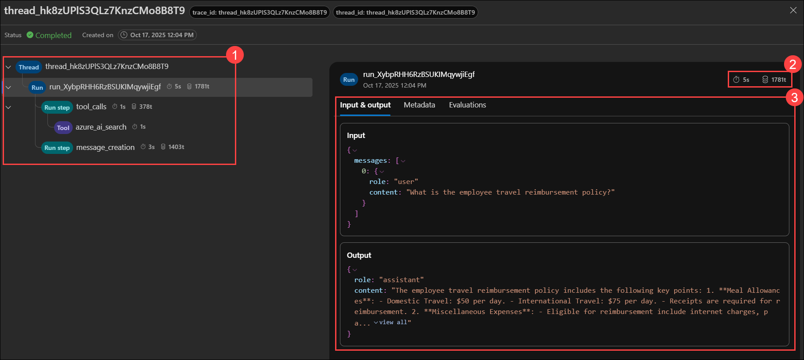

# Exercise 1: Advanced Orchestration with Azure AI Foundry and Microsoft Agent Framework

## Estimated Duration: 60 Minutes

## Overview

In this exercise, you’ll create your first AI Agent using the Azure AI Foundry portal. You’ll begin by uploading enterprise policy documents and ingesting them into Azure AI Search to prepare a knowledge base. Then, you’ll configure the agent using the Microsoft Agent Framework to enable retrieval-augmented generation (RAG). Finally, you’ll test the agent’s responses and analyze execution logs to observe how it retrieves and processes information.

## Exercise Objectives

You'll perform the following task in this exercise

- Task 1: Prepare Knowledge index
- Task 2: Create an AI Agent in Azure AI Foundry
- Task 3: Connect Azure AI Search for RAG
- Task 4: Test and Observe Agent Execution Logs

### Task 1: Prepare Knowledge index

#### About Knowledge Ingestion and Indexing

Before an AI Agent can answer enterprise questions accurately, it must access trusted data sources. Azure AI Search enables Retrieval-Augmented Generation (RAG) by indexing documents such as policies, contracts, and manuals. An index acts like a searchable catalog that breaks content into chunks, adds metadata, and enables the agent to retrieve the right information during a conversation.

In this task, ingest corporate policy documents into Azure Blob Storage and index them using Azure AI Search to create a searchable knowledge base.

1. As you have logged in to Azure Portal as a pre-requisite, from the home page, scroll down, select **Resource Groups** under Navigate.

   

1. From the resource groups pane, select **agenticai** resource group.

1. Once in overview page, from the resource list, select **ai-knowledge-<inject key="DeploymentID" enableCopy="false"/>** search service.

   

1. In the search service overview page, click on **Import data (new)** option to import the pre-uploaded datasets from storage blob.

   

1. In **Choose a data source** pane, select **Azure Blob Storage** from the list.

   

1. In the next pane, select **RAG** option as we are building a retrival based agent.

   

   > here is what each of these options for - 
   >   - **Keyword Search:** Used for traditional search experiences based on exact keywords.It indexes text so users can find information through keyword matching, without AI reasoning.
   >   - **RAG (Retrieval-Augmented Generation):** Combines document retrieval with AI generation.It ingests text (and simple OCR images) so an AI agent can provide grounded, context-aware answers.
   >   - **Multimodal RAG:** Extends RAG to handle complex visual content like diagrams, tables, workflows, or charts.It enables AI to interpret both text and visual elements for richer, insight-based responses.

1. Once selected, in the next page, on connect to your data step, configure the parameters as given below and click on **Next (4)**.

   | Parameter | Configuration |
   |-----------|---------------|
   | Subscription | Leave it as default |
   | Storage account | select **aistorage-<inject key="DeploymentID" enableCopy="false"/> (1)** from drop down |
   | Blob container | select **datasets (2)** container |
   | Parsing mode | select **Markdown (Preview) (3)** |

   

1. In the **vectorize your text** pane, configure the following details and proceed by clicking **Next (6)**.

   | Parameter | Configuration |
   |-----------|---------------|
   | Kind      | select **Azure AI Foundry (preview) (1)** |
   | Azure AI Foundry/Hub project | select **agentic-ai-project (2)** from drop down |
   | Model deployment | select **text-embedding-ada-002 (3)** model |
   | Authentic type | select **API Key (4)** option |
   | Disclaimer Check box | **Check (5)** |

   

1. In **Advanced setting** step, **uncheck Enable sementic ranker** box, as there is no requirement for your agent. Click on **Next (2)**.

   

1. In the final pane, click on **Create**. Once created, pop up will be shown as **create succeeded**, click on **Close**.

   

1. You’ve successfully ingested the dataset into Azure AI Search and created a searchable index.
In the next task, you’ll create an AI agent and connect this index as its knowledge source.

### Task 2: Create an AI Agent in Azure AI Foundry

In this task, you will create a new AI Agent in Azure AI Foundry and configure its core purpose, instructions, and model using the Microsoft Agent Framework interface.

1. Navigate back to your resource group, from the resource list, select **agent-<inject key="DeploymentID" enableCopy="false"/>** AI foundry resource.

   

1. In the next pane, click on **Go to Azure AI Foundry portal**. you will now be navigated to AI Foundry portal, where you will be creating your first agent.

   

1. Once navigated to AI Foundry Portal, select **Agents (1)** from the left menu you will already see an agent pre created. If not created, then please click on **+ New agent (2)** option to get it created.

   

1. Once done, select the created agent, a configuration pane will be opened on the right, provide the following details.

   | Parameter | Configuration |
   |-----------|---------------|
   | Agent name | **EnterpriseAssistant (1)** |
   | Instructions | `You are an enterprise knowledge assistant. Retrieve relevant policy information before answering questions.` **(2)** |

   

1. You’ve successfully created an agent in Azure AI Foundry. Next, it’s time to enrich it with knowledge by connecting your indexed data in the upcoming task.

### Task 3: Connect Azure AI Search for RAG

In this task, you will integrate Azure AI Search with your agent using the knowledge integration panel, enabling retrieval-augmented responses through MCP (Model Context Protocol).

1. In the same agent configuration pane, scroll down and click on **+ Add** for **Knowledge** parameter.

   

1. In the **Add knowledge** pane, select **Azure AI Search** as you have the index prepared in AI Search resource.

   

1. In the next pane, for **Azure AI Search resource connection** option, click on **drop-down arrow (1)** and select **Connect other Azure AI Search resource (2)**.

   

1. In the next pane, review that, correct AI Search resource is selected and click on **Add connection**.

   

1. In the **Adding Azure AI Search** step, configure the following details and click on **Connect (5)** once completed.

   | Parameter | Configuration |
   |-----------|---------------|
   | Azure AI Search resource connection | Ensure **aiknowledge<inject key="DeploymentID" enableCopy="false"/>** connection is selected |
   | Azure AI Searh index | select the index with prefix **rag** |
   | Display name | `knowledge-index` **(3)** |
   | Search type | select **Hybrid(vector + keyword) (4)** |

   

1. The agent is now successfully enriched with knowledge using the Azure AI Search index, which acts as a searchable knowledge base for retrieving accurate information during conversations.

### Task 4: Test and Observe Agent Execution Logs

In this task, you will test your agent by asking policy-related questions and review structured logs to verify tool usage, search calls, and grounded responses.

1. Before testing the agent, connect Application Insights to enable detailed logs and trace visibility.

1. In Azure AI Foundry portal, select **Monitoring (1)** from left menu, select **agent-insights-<inject key="DeploymentID" enableCopy="false"/> (2)** and click on **Connect (3)**

   

1. To test the agent's capability , in the same configuration pane scroll up and select **Try in playground** option.

   

1. A chat panel will open where you can enter your prompts. The agent will now respond using the documents and datasets you’ve connected.

   Sample prmpts - 

   - `What is the employee travel reimbursement policy?`
   - `Summarize the contract approval rules and cite the document`

     

1. Once the agent responded to questions, click on **Thread logs** from top mnu to check the logs and traces of current thread.

   
   
1. Explore and review these metrics, traces and evaluations which showcases a detailed overiew on the agent log.

   

   

1. Now, navigate to **monitoring** pane, where you have connected application insights before and select **Resource usage** tab and review all the metrics and values.

   

1. You’ve successfully built a RAG-based agent powered by curated enterprise datasets.Next, you’ll take this further by enabling multi-agent collaboration, where agents can delegate, reason, and work together intelligently.

<validation step="4a924360-8830-4b51-b959-95eec3703f95" />
 
> **Congratulations** on completing the task! Now, it's time to validate it. Here are the steps:
> - Hit the Validate button for the corresponding task. If you receive a success message, you can proceed to the next task. 
> - If not, carefully read the error message and retry the step, following the instructions in the lab guide.
> - If you need any assistance, please contact us at cloudlabs-support@spektrasystems.com. We are available 24/7 to help.

## Summary

In this exercise, you successfully created your first AI Agent in Azure AI Foundry and connected it to an indexed knowledge base. You uploaded documents, ingested them into Azure AI Search, and enabled RAG through Microsoft Agent Framework integration. By testing the agent and reviewing execution logs, you gained firsthand experience in how agents retrieve grounded information and generate enterprise-ready responses.

