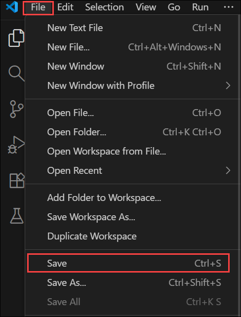
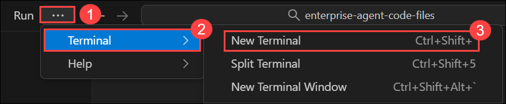
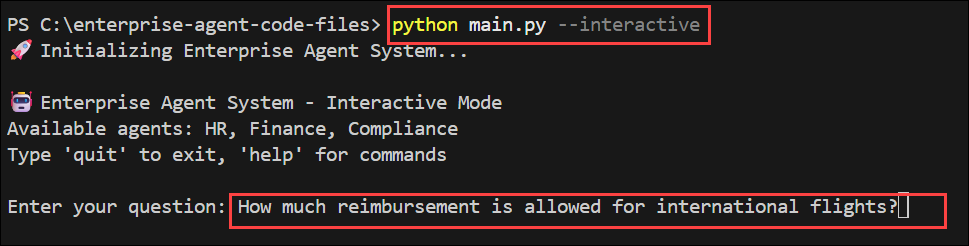

# Exercise 2: Multi-Agent Collaboration and A2A Communication

## Estimated Duration: 90 Minutes

## Overview

In this exercise, you’ll build a multi-agent system using the Microsoft Agent Framework. You’ll define distinct agent roles (Planner, HR, Compliance), deploy them, and configure A2A (Agent-to-Agent) communication to allow one agent to call others. You’ll test a scenario where a user query is delegated through the agent network, and then inspect traces and logs to confirm correct routing.

The Microsoft Agent Framework SDK is the new official development kit for building intelligent, modular agents that can reason, take actions, and collaborate with other agents. It provides:

- Unified Agent Architecture – Replaces AutoGen, Semantic Kernel, and fragmented orchestrators

- Built-in Support for Azure AI Foundry – Deploy agents directly into Foundry’s Agent Service

- Tooling via MCP (Model Context Protocol) – Standardized integration with data, APIs, systems

- Native A2A Communication – Agents can call other agents as autonomous collaborators

This SDK is designed to support enterprise-grade, production-ready agent systems, with reliability, observability, and governance baked in from the start.

## Exercise Objectives

You'll perform the following task in this exercise

- Task 1: Open the Preconfigured VS Code Project
- Task 2: Create Planner Agent
- Task 3: Create HR & Compliance Worker Agents
- Task 4: Define A2A Routing Logic (Agent Graph / Workflow)
- Task 5: Test Multi-Agent Conversation & Inspect Logs

### Task 1: Open the Preconfigured VS Code Project

In this task, you will review the preconfigured folder structure to understand where agent definitions, workflows, and tools are organized. This prepares you to extend the system using the Microsoft Agent Framework SDK.

1. From the LabVM Desktop, open **Visual Studio Code**.

1. Once Visual Studio code is open, click on **file** option and select **open folder** option to open the code file folder.

1. Once in the open folder pane, navigate to `C:\enterprise-agent-code-files` and click on select folder.

1. Please review the folder structure of the enterprise agent.

   

1. Right-Click on **.env.example (1)** file and select **Rename (2)** to rename the file.

   

1. Once done, rename the file from **.env.example** --> **.env** to make this environmnet file active for this agent.

   

1. Replace the content of env file with the below content.

   ```
   AZURE_OPENAI_ENDPOINT=https://agent-<inject key="DeploymentID" enableCopy="false"/>.cognitiveservices.azure.com/
   AZURE_OPENAI_API_KEY=<inject key="AzureAIFoundryApiKey" enableCopy="false"/>
   AZURE_OPENAI_RESPONSES_DEPLOYMENT_NAME=gpt-4o-mini
   AZURE_OPENAI_API_VERSION=2025-03-01-preview
   ```

1. Once done, please save the file. Click on the **file** option from top menu, select **save** to save the file.

   

   


### Task 2: Create Planner Agent

In this task, you will define the Planner Agent that interprets user queries and decides which specialist agent to delegate tasks to. You will configure the agent using the Agent Framework SDK with role-specific instructions.

1. From the list, select `planner_agent.py` under agent folder.

   

1. Add the following python code to configure planner agent.

   ```python
   import os
   import asyncio
   from agent_framework.azure import AzureOpenAIResponsesClient  # type: ignore

   async def build_planner_agent():
      client = AzureOpenAIResponsesClient(
         api_key=os.getenv("AZURE_OPENAI_API_KEY"),
         endpoint=os.getenv("AZURE_OPENAI_ENDPOINT"),
         deployment_name=os.getenv("AZURE_OPENAI_RESPONSES_DEPLOYMENT_NAME"),
         api_version=os.getenv("AZURE_OPENAI_API_VERSION"),
      )
      return client.create_agent(
         name="PlannerAgent",
         instructions=(
               "You are an intelligent routing agent. Analyze user queries and route them to the appropriate specialist. "
               "Available specialists:\n"
               "- HR: Employee policies, leave, benefits, working hours, performance, hiring\n"
               "- FINANCE: Reimbursements, expenses, budgets, travel costs, meal allowances, equipment purchases\n"
               "- COMPLIANCE: GDPR, data privacy, regulatory requirements, legal compliance, audits\n\n"
               "Return exactly one word: HR, FINANCE, or COMPLIANCE. "
               "Consider keywords like: money, cost, budget, reimburse, expense, payment, allowance → FINANCE\n"
               "Keywords like: leave, sick, vacation, policy, employee, benefits → HR\n"
               "Keywords like: GDPR, privacy, compliance, legal, audit, regulation → COMPLIANCE"
         ),
      )

   async def classify_target(planner_agent, user_query: str) -> str:
      result = await planner_agent.run(
         "Analyze and route this query:\n\n"
         f"User query: {user_query}\n\n"
         "Return exactly one word: HR, FINANCE, or COMPLIANCE."
      )
      # Extract the text content from the AgentRunResponse object
      text = str(result).strip().lower()
      
      # Advanced classification with fallback logic
      if "finance" in text or "financial" in text:
         return "FINANCE"
      elif "hr" in text or "human" in text:
         return "HR"
      elif "compliance" in text or "legal" in text:
         return "COMPLIANCE"
      else:
         # Fallback keyword analysis if agent response is unclear
         query_lower = user_query.lower()
         finance_keywords = ["reimburs", "expense", "cost", "budget", "money", "payment", "allowance", "travel", "meal", "flight", "hotel"]
         hr_keywords = ["leave", "sick", "vacation", "employee", "benefit", "policy", "hire", "performance", "work"]
         compliance_keywords = ["gdpr", "privacy", "compliance", "legal", "audit", "regulation", "data protection"]
         
         finance_score = sum(1 for keyword in finance_keywords if keyword in query_lower)
         hr_score = sum(1 for keyword in hr_keywords if keyword in query_lower)
         compliance_score = sum(1 for keyword in compliance_keywords if keyword in query_lower)
         
         if finance_score > hr_score and finance_score > compliance_score:
               return "FINANCE"
         elif hr_score > compliance_score:
               return "HR"
         else:
               return "COMPLIANCE"
   ```

   

   > Purpose of Planner Agent:
   > - This agent is designed to analyze user queries and decide which specialist agent (HR, Finance, or Compliance) should handle the response.

   >Agent Creation Using AzureOpenAIResponsesClient:
   > - The build_planner_agent() function initializes the Planner using the Agent Framework SDK with API-based credentials loaded from environment variables.

   >LLM-Guided Routing (Primary Logic):
   > - The Planner agent is instructed to return exactly one word — HR, FINANCE, or COMPLIANCE — based on keywords and context in the query.

   >classify_target() for Decision Making:
   > - This function first uses an await agent.run() call to ask the Planner which specialist to select. If the response is unclear, it applies a fallback keyword-based analysis.

   >Hybrid AI + Heuristic Strategy:
   > - The design ensures reliable routing, combining model reasoning with manual keyword scoring, making the Planner robust even when AI output is vague.

1. Once done, please save the file. Click on the **file** option from top menu, select **save** to save the file.

   

### Task 3: Create Worker Agents

In this task, you will develop domain-specific agents responsible for HR, Finance and Compliance knowledge. Each agent will be registered in the Agent Registry to enable discovery and delegation through A2A communication.

1. From the list, select `hr_agent.py` under agent folder and add the following python code to configure hr agent. Add the following python code to configure hr agent.

   ```python
   import os
   import asyncio
   from agent_framework.azure import AzureOpenAIResponsesClient  # type: ignore

   async def build_hr_agent():
      client = AzureOpenAIResponsesClient(
         api_key=os.getenv("AZURE_OPENAI_API_KEY"),
         endpoint=os.getenv("AZURE_OPENAI_ENDPOINT"),
         deployment_name=os.getenv("AZURE_OPENAI_RESPONSES_DEPLOYMENT_NAME"),
         api_version=os.getenv("AZURE_OPENAI_API_VERSION"),
      )
      return client.create_agent(
         name="HRAgent",
         instructions=(
               "You are an expert HR policy specialist with deep knowledge of employment law and best practices. "
               "Answer questions about:\n"
               "- Leave policies (sick, vacation, parental, bereavement)\n"
               "- Employee benefits (health insurance, retirement, wellness programs)\n" 
               "- Performance management and reviews\n"
               "- Hiring, onboarding, and termination procedures\n"
               "- Working hours, overtime, and flexible work arrangements\n"
               "- Employee relations and conflict resolution\n"
               "- Training and development programs\n\n"
               "Provide specific, actionable guidance with policy references where applicable. "
               "Be empathetic and professional in your responses."
         ),
      )
   ```

   

   >Purpose of the HR Agent:
   > - This agent acts as a dedicated HR policy expert, trained to respond to questions related to employee welfare, leave structures, benefits, and workplace procedures.

   >Agent Initialization with Azure Responses Client:
   > - The build_hr_agent() function initializes the agent using AzureOpenAIResponsesClient, authenticated through API keys and endpoint values stored in environment variables.

   >Domain-Specific Specialization:
   > - The instructions section clearly defines the HR agent’s scope — including leave types, benefits, onboarding, employee relations, and performance management — ensuring it responds only to HR-related queries.

   >Professional and Empathetic Tone:
   > - The agent is designed to mimic real HR communication standards, providing guidance that is accurate, professional, and empathetic, ideal for internal organizational assistants.

   >Foundation for Multi-Agent Collaboration:
   > - Once built, this HR agent will be invoked by the Planner Agent, allowing automated delegation in multi-agent workflows when HR-related queries are detected.

1. Once done, please save the file. Click on the **file** option from top menu, select **save** to save the file.

   

1. From the list, select `finance_agent.py` under agent folder and add the following python code to configure compliance agent. Add the following python code to configure finance agent.

   ```python
   import os
   import asyncio
   from agent_framework.azure import AzureOpenAIResponsesClient  # type: ignore

   async def build_finance_agent():
      client = AzureOpenAIResponsesClient(
         api_key=os.getenv("AZURE_OPENAI_API_KEY"),
         endpoint=os.getenv("AZURE_OPENAI_ENDPOINT"),
         deployment_name=os.getenv("AZURE_OPENAI_RESPONSES_DEPLOYMENT_NAME"),
         api_version=os.getenv("AZURE_OPENAI_API_VERSION"),
      )
      return client.create_agent(
         name="FinanceAgent",
         instructions=(
               "You are a finance and reimbursement specialist. Answer questions about "
               "expense policies, reimbursement limits, budget approvals, travel expenses, "
               "meal allowances, equipment purchases, and financial procedures. Provide "
               "specific amounts, policies, and actionable guidance."
         ),
      )
   ```

   

   >Specialized Finance Role:
   > - This agent is designed to handle all finance-related topics, including reimbursement policies, travel budgets, allowances, and purchase approvals.

   >Initialization via Agent Framework SDK:
   > - The build_finance_agent() function creates an agent using AzureOpenAIResponsesClient, leveraging API key authentication from secure environment variables.

   >Policy-Focused Instructions:
   > - The agent's instructions clearly limit its responsibility to financial procedures, ensuring accurate answers about costs, payments, budgets, and corporate expense rules.

   >Precision and Actionable Outputs:
   > - Unlike general-purpose agents, this finance assistant is instructed to provide specific policy values, such as limits, eligibility, or approval flows, making it practical for employees.

   >Supports Planner Delegation (A2A):
   > - This agent will be invoked automatically when the Planner detects finance-related keywords or queries, enabling seamless multi-agent collaboration in the system.

1. Once done, please save the file. Click on the **file** option from top menu, select **save** to save the file.

   

1. From the list, select `compliance_agent.py` under agent folder and add the following python code to configure compliance agent. Add the following python code to configure compliance agent.

   ```python
   import os
   import asyncio
   from agent_framework.azure import AzureOpenAIResponsesClient  # type: ignore

   async def build_compliance_agent():
      client = AzureOpenAIResponsesClient(
         api_key=os.getenv("AZURE_OPENAI_API_KEY"),
         endpoint=os.getenv("AZURE_OPENAI_ENDPOINT"),
         deployment_name=os.getenv("AZURE_OPENAI_RESPONSES_DEPLOYMENT_NAME"),
         api_version=os.getenv("AZURE_OPENAI_API_VERSION"),
      )
      return client.create_agent(
         name="ComplianceAgent", 
         instructions=(
               "You are a senior compliance and legal specialist with expertise in multiple jurisdictions. "
               "Provide authoritative guidance on:\n"
               "- GDPR and data protection regulations (EU, UK, US state laws)\n"
               "- Privacy policies and data processing agreements\n"
               "- Regulatory compliance (SOX, HIPAA, PCI-DSS, ISO standards)\n"
               "- Risk assessment and audit requirements\n"
               "- Contract law and vendor agreements\n"
               "- Information security policies\n"
               "- Cross-border data transfers and adequacy decisions\n"
               "- Breach notification requirements\n\n"
               "Always provide factual, well-researched answers with relevant legal citations. "
               "Include practical implementation steps and potential risks. Use formal, professional tone."
         ),
      )
   ```

   

   >Purpose of the Agent:
   > - This agent serves as a dedicated legal and compliance authority, responsible for handling queries related to GDPR, regulatory frameworks, contract law, risk assessments, and security standards.

   >Agent Initialization:
   > - The build_compliance_agent() function uses AzureOpenAIResponsesClient with API key authentication to register the Compliance agent through the Microsoft Agent Framework SDK.

   >Regulatory Expertise Defined in Instructions:
   > - The instructions provide a clear compliance scope — including global privacy regulations (GDPR, HIPAA, SOX), audit readiness, legal agreements, and breach protocols — ensuring high-trust responses.

   >Tone and Output Expectations:
   > - This agent is configured to deliver answers in a formal, authoritative tone, including legal citations or implementation recommendations when applicable.

   >Role in Multi-Agent System:
   > - During A2A delegation, the Planner Agent will route legal or compliance-related queries to this specialist, maintaining accuracy and governance in enterprise decision workflows.

1. Once done, please save the file. Click on the **file** option from top menu, select **save** to save the file.

   

### Task 4: Define A2A Routing Logic (Agent Graph / Workflow)

Agent-to-Agent (A2A) is a core capability of the Microsoft Agent Framework that allows one agent to autonomously delegate tasks to another agent.

In this task, you will implement routing logic using an Agent Workflow so the Planner can autonomously call HR or Compliance agents based on query intent. This establishes true multi-agent collaboration.

1. From the list, select `main.py` under agent folder and add the following python code to configure A2A communiction flow agent. Add the following python code to configure agent routing logic.

   ```python
   import asyncio
   import time
   import logging
   from typing import Dict, Any
   from utils.env import load_env
   from agents.planner_agent import build_planner_agent, classify_target
   from agents.hr_agent import build_hr_agent
   from agents.compliance_agent import build_compliance_agent
   from agents.finance_agent import build_finance_agent

   # Configure logging
   logging.basicConfig(level=logging.INFO, format='%(asctime)s - %(levelname)s - %(message)s')

   async def run_multi_agent(query: str, agents: Dict[str, Any]) -> Dict[str, Any]:
      """
      Advanced multi-agent system with routing, timing, and comprehensive response handling.
      """
      start_time = time.time()
      
      try:
         # Step 1: Route the query
         logging.info(f"Routing query: {query[:50]}...")
         target = await classify_target(agents["planner"], query)
         logging.info(f"Query routed to: {target}")
         
         # Step 2: Get response from appropriate agent
         agent_mapping = {
               "HR": ("hr", "HRAgent"),
               "FINANCE": ("finance", "FinanceAgent"), 
               "COMPLIANCE": ("compliance", "ComplianceAgent")
         }
         
         if target in agent_mapping:
               agent_key, agent_name = agent_mapping[target]
               answer = await agents[agent_key].run(query)
         else:
               # Fallback to HR if routing unclear
               logging.warning(f"Unknown target '{target}', falling back to HR")
               answer = await agents["hr"].run(query)
               target = "HR"
               agent_name = "HRAgent"
         
         # Step 3: Process response
         response_time = time.time() - start_time
         
         return {
               "query": query,
               "routed_to": target,
               "agent_name": agent_name,
               "answer": str(answer),
               "response_time": round(response_time, 2),
               "timestamp": time.strftime("%Y-%m-%d %H:%M:%S"),
               "success": True
         }
         
      except Exception as e:
         logging.error(f"Error processing query: {e}")
         return {
               "query": query,
               "routed_to": "ERROR",
               "agent_name": "ErrorHandler",
               "answer": f"I apologize, but I encountered an error processing your request: {str(e)}",
               "response_time": round(time.time() - start_time, 2),
               "timestamp": time.strftime("%Y-%m-%d %H:%M:%S"),
               "success": False
         }

   def format_response(result: Dict[str, Any]) -> str:
      """Format the agent response for display."""
      status_icon = "✅" if result["success"] else "❌"
      
      formatted = f"""
   {status_icon} Agent Response Summary:
   ┌─ Routed to: {result['routed_to']} ({result['agent_name']})
   ├─ Response time: {result['response_time']}s
   ├─ Timestamp: {result['timestamp']}
   └─ Status: {'Success' if result['success'] else 'Error'}

   💬 Answer:
   {result['answer']}
   """
      return formatted

   async def run_interactive_mode(agents: Dict[str, Any]):
      """Interactive mode for real-time queries."""
      print("\n🤖 Enterprise Agent System - Interactive Mode")
      print("Available agents: HR, Finance, Compliance")
      print("Type 'quit' to exit, 'help' for commands\n")
      
      while True:
         try:
               query = input("Enter your question: ").strip()
               
               if query.lower() in ['quit', 'exit', 'q']:
                  print("👋 Goodbye!")
                  break
               elif query.lower() == 'help':
                  print("""
   📋 Available Commands:
   - Ask any question about HR, Finance, or Compliance
   - 'quit' or 'exit' - Exit the system
   - 'help' - Show this help message

   🎯 Example questions:
   - "What's the travel reimbursement limit for meals?"
   - "How many vacation days do employees get?"  
   - "Do we need GDPR compliance for EU customers?"
   """)
                  continue
               elif not query:
                  continue
                  
               result = await run_multi_agent(query, agents)
               print(format_response(result))
               
         except KeyboardInterrupt:
               print("\n👋 Goodbye!")
               break
         except Exception as e:
               logging.error(f"Interactive mode error: {e}")
               print(f"❌ Error: {e}")

   async def run_batch_tests(agents: Dict[str, Any]):
      """Run predefined test queries."""
      test_queries = [
               "How much reimbursement is allowed for international flights?",
               "Is employee data protected under GDPR?",
               "How many sick leave days do employees get?"

      ]
      
      print("🧪 Running batch tests...\n")
      
      for i, query in enumerate(test_queries, 1):
         print(f"{'='*80}")
         print(f"TEST {i}/{len(test_queries)}: {query}")
         print(f"{'='*80}")
         
         result = await run_multi_agent(query, agents)
         print(format_response(result))
         
         # Small delay between queries for better readability
         if i < len(test_queries):
               await asyncio.sleep(0.5)

   async def main():
      """Main application entry point with enhanced features."""
      print("🚀 Initializing Enterprise Agent System...")
      
      try:
         # Load environment and build agents
         load_env()
         logging.info("Building agent network...")
         
         agents = {
               "planner": await build_planner_agent(),
               "hr": await build_hr_agent(), 
               "compliance": await build_compliance_agent(),
               "finance": await build_finance_agent()
         }
         
         logging.info("✅ All agents initialized successfully")
         
         # Check if running interactively or in batch mode
         import sys
         if len(sys.argv) > 1 and sys.argv[1] == "--interactive":
               await run_interactive_mode(agents)
         else:
               await run_batch_tests(agents)
               
      except Exception as e:
         logging.error(f"System initialization failed: {e}")
         print(f"❌ Failed to start system: {e}")

   if __name__ == "__main__":
      asyncio.run(main())

   ```

   

   >Central Execution Engine:
   > - This script acts as the core orchestrator, coordinating all agents (Planner, HR, Finance, Compliance) and managing multi-agent routing using the Microsoft Agent Framework.

   >Agent Network Initialization:
   > - It loads environment settings, builds each agent with await build_*_agent(), and registers them into a shared dictionary for easy delegation.

   >Advanced A2A Routing:
   > - The run_multi_agent() function routes user queries to the correct specialist through the Planner, then awaits the specialist agent’s response. It captures routing, timing, success status, and final answer.

   >Multiple Execution Modes:
   > - Batch Mode: Runs predefined test queries.
   > - Interactive Mode (--interactive): Enables real-time chat for live testing and exploration.

   >Production-Ready Resilience:
   > - Includes response formatting, timestamps, error fallback mechanisms, and logging — laying a strong foundation for observability, telemetry, and AgentOps in later exercises.

1. Once done, please save the file. Click on the **file** option from top menu, select **save** to save the file.

   

### Task 5: Test Multi-Agent Conversation & Inspect Logs

In this task, you will run end-to-end test queries through the multi-agent system and observe agent collaboration using logs and telemetry in Azure AI Foundry.

1. You have successfully configured the multi agent system with a planner agent and worker agents. Now, you'll test the working of this multi-agent system.

   >**Note:** Although the multi-agent system is now configured with LLM capabilities, it does not yet have MCP integration or access to external knowledge sources such as datasets or Azure AI Search indexes. At this stage, the agents will rely solely on their general model intelligence to answer questions.

1. Select the **... (1)** option from the top menu to extend the menu. Select **Terminal (2)** and click on **New Terminal (3)**.

   

1. Once the terminal is open, run the following command to run the agent and review the responses for the test prompts provided in the code file.

   ```
   python main.py
   ```

   

   > Check **Routed to** parameter and review how the agent is determining and routing the requests to respective worker agents.

1. Now, run the agent again on interactive mode by adding `--interactive` flag. This lets you input the question and get the response back. Provide the below prompt as question once it asks.

   > `Is employee data protected under GDPR?` 

   ```
   python main.py --interactive
   ```

   

1. Once after getting the response, in the next prompt add `q` to quit the agent or stop the agent.

   

## Summary

In this exercise, you defined three agents (Planner, HR, Compliance) using the Microsoft Agent Framework SDK and registered them. You built a routing workflow to delegate user queries via Agent-to-Agent calls. You tested a multi-agent scenario and inspected logs to confirm correct message routing and execution flow.