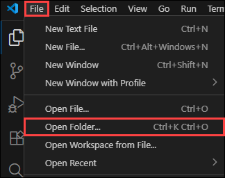
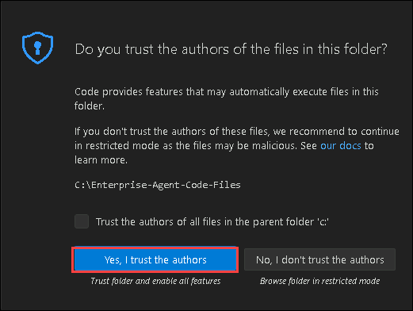

# Exercise 2: Multi-Agent Collaboration and A2A Communication

## Estimated Duration: 90 Minutes

## Overview

In this exercise, you’ll build a multi-agent system using the Microsoft Agent Framework. You’ll define distinct agent roles (Planner, HR, Compliance), deploy them, and configure A2A (Agent-to-Agent) communication to allow one agent to call others. You’ll test a scenario where a user query is delegated through the agent network, and then inspect traces and logs to confirm correct routing.

The Microsoft Agent Framework SDK is the new official development kit for building intelligent, modular agents that can reason, take actions, and collaborate with other agents. It provides:

- Unified Agent Architecture – Replaces AutoGen, Semantic Kernel, and fragmented orchestrators

- Built-in Support for Microsoft Foundry – Deploy agents directly into Foundry’s Agent Service

- Tooling via MCP (Model Context Protocol) – Standardized integration with data, APIs, systems

- Native A2A Communication – Agents can call other agents as autonomous collaborators

This SDK is designed to support enterprise-grade, production-ready agent systems, with reliability, observability, and governance baked in from the start.

## Exercise Objectives

You'll perform the following task in this exercise

- Task 1: Open the Preconfigured VS Code Project
- Task 2: Create Planner Agent
- Task 3: Create HR & Compliance Worker Agents
- Task 4: Define A2A Routing Logic (Agent Graph / Workflow)
- Task 5: Test Multi-Agent Conversation & Inspect Logs

### Task 1: Open the Preconfigured VS Code Project

In this task, you will review the preconfigured folder structure to understand where agent definitions, workflows, and tools are organized. This prepares you to extend the system using the Microsoft Agent Framework SDK.

1. From the LabVM Desktop, open **Visual Studio Code**.

1. Once Visual Studio code is open, click on **file** option and select **open folder** option to open the code file folder.

   

1. Once in the open folder pane, navigate to `C:\enterprise-agent-code-files` and click on select folder.

1. Once opened, a popup window will be opened, click on **Yes, I trust authors** option.

   

1. Please review the folder structure of the enterprise agent.

   

1. Right-Click on **.env.example (1)** file and select **Rename (2)** to rename the file.

   

1. Once done, rename the file from **.env.example** --> **.env** to make this environment file active for this agent.

   

1. Replace the content of env file with the below content.

   ```
   AZURE_OPENAI_ENDPOINT=https://agent-<inject key="DeploymentID" enableCopy="false"/>.cognitiveservices.azure.com/
   AZURE_OPENAI_API_KEY=<inject key="AzureAIFoundryApiKey" enableCopy="false"/>
   AZURE_OPENAI_RESPONSES_DEPLOYMENT_NAME=gpt-4o-mini
   AZURE_OPENAI_API_VERSION=2025-03-01-preview
   ```

1. Once done, please save the file. Click on the **file** option from top menu, select **save** to save the file.

   

   


### Task 2: Create Planner Agent

In this task, you will define the Planner Agent that interprets user queries and decides which specialist agent to delegate tasks to. You will configure the agent using the Agent Framework SDK with role-specific instructions.

1. From the list, select `planner_agent.py` under agent folder.

   

1. Add the following Python code to configure the Planner Agent. The Planner Agent acts as the **entry point** for all user queries in the multi-agent system. Instead of forcing users to decide which department to contact, this agent analyzes the query and intelligently routes it to the correct specialist agent (HR, Finance, or Compliance).

   > **Purpose of the Planner Agent (Why it Exists):**  
   > - In real-world enterprise copilots, users ask questions in natural language without knowing which department (HR, Finance, or Compliance) should handle them.  
   > - The Planner Agent acts as a smart front door that understands the *intent* behind the query and decides which specialist agent should take over, keeping the user experience seamless and intuitive.

   ---

   > **Agent Creation Using AzureOpenAIResponsesClient:**  
   > - The Planner Agent is created using the Azure OpenAI Responses API through the Agent Framework SDK.  
   > - Environment-based configuration (API key, endpoint, deployment, version) allows the same code to work across development, testing, and production without changes, following enterprise security best practices.

   ---

   > **LLM-Guided Intelligent Routing (Core Logic):**  
   > - Instead of relying only on hard-coded rules, the Planner uses an LLM to understand context, phrasing, and user intent.  
   > - This allows it to correctly route queries even when users don’t use exact keywords (for example, understanding that “team dinner reimbursement” belongs to Finance).

   ---

   > **Strict One-Word Output for Reliable Automation:**  
   > - The Planner is explicitly instructed to return **only one word** — HR, FINANCE, or COMPLIANCE.  
   > - This design makes downstream routing deterministic and predictable, avoiding complex parsing and preventing accidental hallucinated explanations from the model.

   ---

   > **`classify_target()` for Safe Decision Making:**  
   > - This function first asks the Planner Agent to classify the query using model reasoning.  
   > - If the response is unclear or deviates from expectations, the function safely interprets or corrects the result before routing.

   ---

   > **Hybrid AI + Rule-Based Fallback Strategy:**  
   > - To ensure production-grade reliability, a keyword-scoring fallback is used when the AI response is ambiguous.  
   > - This hybrid approach combines the flexibility of AI with the certainty of deterministic logic, ensuring that every user query is routed correctly—no matter what.

   ```python
   import os
   import asyncio
   from agent_framework.azure import AzureOpenAIResponsesClient  # type: ignore

   async def build_planner_agent():
      """
      Creates and configures a planner agent that routes user queries to appropriate specialists.
      
      Returns:
         An agent client configured with routing instructions for HR, Finance, and Compliance queries.
      """
      # Initialize Azure OpenAI client with credentials from environment variables
      client = AzureOpenAIResponsesClient(
         api_key=os.getenv("AZURE_OPENAI_API_KEY"),
         endpoint=os.getenv("AZURE_OPENAI_ENDPOINT"),
         deployment_name=os.getenv("AZURE_OPENAI_RESPONSES_DEPLOYMENT_NAME"),
         api_version=os.getenv("AZURE_OPENAI_API_VERSION"),
      )
      
      # Create agent with specialized routing instructions
      return client.create_agent(
         name="PlannerAgent",
         instructions=(
               "You are an intelligent routing agent. Analyze user queries and route them to the appropriate specialist. "
               "Available specialists:\n"
               "- HR: Employee policies, leave, benefits, working hours, performance, hiring\n"
               "- FINANCE: Reimbursements, expenses, budgets, travel costs, meal allowances, equipment purchases\n"
               "- COMPLIANCE: GDPR, data privacy, regulatory requirements, legal compliance, audits\n\n"
               "Return exactly one word: HR, FINANCE, or COMPLIANCE. "
               "Consider keywords like: money, cost, budget, reimburse, expense, payment, allowance → FINANCE\n"
               "Keywords like: leave, sick, vacation, policy, employee, benefits → HR\n"
               "Keywords like: GDPR, privacy, compliance, legal, audit, regulation → COMPLIANCE"
         ),
      )

   async def classify_target(planner_agent, user_query: str) -> str:
      """
      Classifies a user query and routes it to the appropriate department using the planner agent.
      
      Args:
         planner_agent: The initialized planner agent instance
         user_query: The user's question or request to be classified
         
      Returns:
         str: One of "HR", "FINANCE", or "COMPLIANCE" indicating the target department
      """
      # Send the query to the planner agent for classification
      result = await planner_agent.run(
         "Analyze and route this query:\n\n"
         f"User query: {user_query}\n\n"
         "Return exactly one word: HR, FINANCE, or COMPLIANCE."
      )
      
      # Extract and normalize the text response from the agent
      text = str(result).strip().lower()
      
      # Primary classification: Check if agent response contains department names
      if "finance" in text or "financial" in text:
         return "FINANCE"
      elif "hr" in text or "human" in text:
         return "HR"
      elif "compliance" in text or "legal" in text:
         return "COMPLIANCE"
      else:
         # Fallback mechanism: If agent response is unclear, use keyword-based scoring
         query_lower = user_query.lower()
         
         # Define keyword lists for each department category
         finance_keywords = ["reimburs", "expense", "cost", "budget", "money", "payment", "allowance", "travel", "meal", "flight", "hotel"]
         hr_keywords = ["leave", "sick", "vacation", "employee", "benefit", "policy", "hire", "performance", "work"]
         compliance_keywords = ["gdpr", "privacy", "compliance", "legal", "audit", "regulation", "data protection"]
         
         # Calculate match scores by counting keyword occurrences in the query
         finance_score = sum(1 for keyword in finance_keywords if keyword in query_lower)
         hr_score = sum(1 for keyword in hr_keywords if keyword in query_lower)
         compliance_score = sum(1 for keyword in compliance_keywords if keyword in query_lower)
         
         # Return the department with the highest keyword match score
         if finance_score > hr_score and finance_score > compliance_score:
               return "FINANCE"
         elif hr_score > compliance_score:
               return "HR"
         else:
               return "COMPLIANCE"
   ```

   

1. Once done, please save the file. Click on the **file** option from top menu, select **save** to save the file.

   

### Task 3: Create Worker Agents

In this task, you will develop domain-specific agents responsible for HR, Finance and Compliance knowledge. Each agent will be registered in the Agent Registry to enable discovery and delegation through A2A communication.

1. From the list, select `hr_agent.py` under agent folder and add the following python code to configure hr agent. Add the following python code to configure hr agent.

   > **Purpose of the HR Agent:**  
   > - The HR Agent functions as a **dedicated human resources subject-matter expert** within the multi-agent system.  
   > - It is designed to handle employee-centric queries related to workplace policies, leave entitlements, benefits, performance management, and overall employee well-being, ensuring accurate and consistent HR guidance.

   ---

   > **Agent Initialization Using AzureOpenAIResponsesClient:**  
   > - The `build_hr_agent()` function initializes the HR Agent using the Azure OpenAI Responses API via the Agent Framework SDK.  
   > - Authentication and configuration details such as API keys, endpoints, deployment names, and API versions are securely loaded from environment variables, enabling enterprise-grade deployment and easy environment portability.

   ---

   > **Domain-Specific HR Specialization:**  
   > - The agent instructions explicitly define the HR domain boundaries, covering areas such as leave policies, employee benefits, onboarding, performance reviews, and employee relations.  
   > - This strict scoping ensures the agent responds **only** to HR-related questions and avoids cross-domain answers, improving accuracy and trust.

   ---

   > **Policy-Aware and Actionable Guidance:**  
   > - The HR Agent is instructed to provide clear, practical, and policy-aligned responses rather than generic advice.  
   > - Where applicable, it references standard HR practices or policies, helping employees understand both the *what* and the *why* behind HR decisions.

   ---

   > **Professional and Empathetic Communication Style:**  
   > - The agent is designed to mirror real-world HR communication standards by maintaining a tone that is professional, respectful, and empathetic.  
   > - This is especially important for sensitive topics such as leave, performance discussions, or employee relations, making the agent suitable for internal organizational use.

   ---

   > **Foundation for Multi-Agent Collaboration:**  
   > - Once created, the HR Agent operates as a specialist component within a larger multi-agent architecture.  
   > - It is invoked by the Planner Agent whenever an HR-related intent is detected, enabling seamless delegation and coordinated responses across multiple domain agents.

   ```python
   import os
   import asyncio
   from agent_framework.azure import AzureOpenAIResponsesClient  # type: ignore

   async def build_hr_agent():
      """
      Creates and configures an HR specialist agent for handling employee-related queries.
      
      Returns:
         An agent client configured with HR policy expertise and guidance instructions.
      """
      # Initialize Azure OpenAI client with credentials from environment variables
      client = AzureOpenAIResponsesClient(
         api_key=os.getenv("AZURE_OPENAI_API_KEY"),
         endpoint=os.getenv("AZURE_OPENAI_ENDPOINT"),
         deployment_name=os.getenv("AZURE_OPENAI_RESPONSES_DEPLOYMENT_NAME"),
         api_version=os.getenv("AZURE_OPENAI_API_VERSION"),
      )
      
      # Create HR specialist agent with comprehensive employment and policy knowledge
      return client.create_agent(
         name="HRAgent",
         instructions=(
               "You are an expert HR policy specialist with deep knowledge of employment law and best practices. "
               "Answer questions about:\n"
               "- Leave policies (sick, vacation, parental, bereavement)\n"
               "- Employee benefits (health insurance, retirement, wellness programs)\n" 
               "- Performance management and reviews\n"
               "- Hiring, onboarding, and termination procedures\n"
               "- Working hours, overtime, and flexible work arrangements\n"
               "- Employee relations and conflict resolution\n"
               "- Training and development programs\n\n"
               "Provide specific, actionable guidance with policy references where applicable. "
               "Be empathetic and professional in your responses."
         ),
      )
   ```

   

1. Once done, please save the file. Click on the **file** option from top menu, select **save** to save the file.

   

1. From the list, select `finance_agent.py` under agent folder and add the following python code to configure compliance agent. Add the following python code to configure finance agent.

   > **Specialized Finance Agent Role:**  
   > - The Finance Agent acts as a **dedicated financial policy expert** within the multi-agent system.  
   > - It is responsible for handling all finance-related queries, including reimbursements, travel expenses, meal allowances, budgets, and purchase approvals, ensuring consistent and policy-compliant financial guidance.

   ---

   > **Agent Initialization Using Agent Framework SDK:**  
   > - The `build_finance_agent()` function creates the Finance Agent using the Azure OpenAI Responses API through the Agent Framework SDK.  
   > - Authentication details such as API keys, endpoints, deployment names, and API versions are securely retrieved from environment variables, aligning with enterprise security and deployment best practices.

   ---

   > **Policy-Focused and Scoped Instructions:**  
   > - The agent instructions explicitly limit the Finance Agent’s scope to financial procedures and policies.  
   > - This clear boundary ensures the agent responds accurately to questions about costs, payments, budgets, reimbursements, and corporate expense rules, without drifting into other domains.

   ---

   > **Precision-Oriented and Actionable Responses:**  
   > - Unlike general-purpose assistants, the Finance Agent is designed to deliver **specific, actionable outputs**.  
   > - It provides concrete details such as reimbursement limits, eligibility criteria, approval workflows, and financial procedures, making it immediately useful for employees and finance teams.

   ---

   > **Enterprise-Ready Financial Guidance:**  
   > - The agent’s responses are structured to reflect real-world finance operations, emphasizing clarity, accuracy, and compliance with internal policies.  
   > - This makes the agent suitable for internal use cases where financial accuracy and consistency are critical.

   ---

   > **Seamless Planner-Based Delegation (A2A):**  
   > - The Finance Agent is invoked automatically by the Planner Agent whenever finance-related intent or keywords are detected.  
   > - This enables smooth agent-to-agent (A2A) collaboration, ensuring each query is handled by the correct domain expert within the multi-agent workflow.

   ```python
   import os
   import asyncio
   from agent_framework.azure import AzureOpenAIResponsesClient  # type: ignore

   async def build_finance_agent():
      """
      Creates and configures a Finance specialist agent for handling financial and expense queries.
      
      Returns:
         An agent client configured with finance policy and reimbursement expertise.
      """
      # Initialize Azure OpenAI client with credentials from environment variables
      client = AzureOpenAIResponsesClient(
         api_key=os.getenv("AZURE_OPENAI_API_KEY"),
         endpoint=os.getenv("AZURE_OPENAI_ENDPOINT"),
         deployment_name=os.getenv("AZURE_OPENAI_RESPONSES_DEPLOYMENT_NAME"),
         api_version=os.getenv("AZURE_OPENAI_API_VERSION"),
      )
      
      # Create Finance specialist agent with expertise in expenses and reimbursements
      return client.create_agent(
         name="FinanceAgent",
         instructions=(
               "You are a finance and reimbursement specialist. Answer questions about "
               "expense policies, reimbursement limits, budget approvals, travel expenses, "
               "meal allowances, equipment purchases, and financial procedures. Provide "
               "specific amounts, policies, and actionable guidance."
         ),
      )
   ```

   

1. Once done, please save the file. Click on the **file** option from top menu, select **save** to save the file.

   

1. From the list, select `compliance_agent.py` under agent folder and add the following python code to configure compliance agent. Add the following python code to configure compliance agent.

   > **Purpose of the Compliance Agent:**  
   > - The Compliance Agent acts as a **dedicated legal and regulatory authority** within the multi-agent system.  
   > - It is responsible for handling queries related to data privacy, regulatory compliance, legal obligations, risk management, and security standards, ensuring responses meet enterprise governance requirements.

   ---

   > **Agent Initialization Using AzureOpenAIResponsesClient:**  
   > - The `build_compliance_agent()` function initializes the Compliance Agent using the Azure OpenAI Responses API via the Microsoft Agent Framework SDK.  
   > - Authentication and configuration details (API keys, endpoint, deployment name, and API version) are securely loaded from environment variables, supporting enterprise-grade security and portability.

   ---

   > **Clearly Defined Regulatory and Legal Scope:**  
   > - The agent instructions explicitly define its domain of expertise, covering global privacy regulations (GDPR, HIPAA, SOX, PCI-DSS), audit readiness, contract law, and information security policies.  
   > - This clear scoping ensures the agent delivers **high-trust, compliance-focused responses** without crossing into non-legal domains.

   ---

   > **Authoritative, Policy-Driven Guidance:**  
   > - The Compliance Agent is designed to provide factual, well-researched answers backed by legal references or regulatory citations where applicable.  
   > - It also includes practical implementation guidance and highlights potential risks, enabling informed and compliant decision-making.

   ---

   > **Formal and Professional Communication Style:**  
   > - The agent is configured to respond in a formal, authoritative tone that aligns with legal and compliance communication standards.  
   > - This makes it suitable for enterprise use cases involving audits, regulatory reviews, or policy clarification.

   ---

   > **Role in Multi-Agent Collaboration (A2A):**  
   > - Within the multi-agent architecture, the Compliance Agent is invoked automatically by the Planner Agent when legal or compliance-related intent is detected.  
   > - This agent-to-agent (A2A) delegation ensures accuracy, governance, and regulatory integrity across enterprise workflows.

   ```python
   import os
   import asyncio
   from agent_framework.azure import AzureOpenAIResponsesClient  # type: ignore

   async def build_compliance_agent():
      client = AzureOpenAIResponsesClient(
         api_key=os.getenv("AZURE_OPENAI_API_KEY"),
         endpoint=os.getenv("AZURE_OPENAI_ENDPOINT"),
         deployment_name=os.getenv("AZURE_OPENAI_RESPONSES_DEPLOYMENT_NAME"),
         api_version=os.getenv("AZURE_OPENAI_API_VERSION"),
      )
      return client.create_agent(
         name="ComplianceAgent", 
         instructions=(
               "You are a senior compliance and legal specialist with expertise in multiple jurisdictions. "
               "Provide authoritative guidance on:\n"
               "- GDPR and data protection regulations (EU, UK, US state laws)\n"
               "- Privacy policies and data processing agreements\n"
               "- Regulatory compliance (SOX, HIPAA, PCI-DSS, ISO standards)\n"
               "- Risk assessment and audit requirements\n"
               "- Contract law and vendor agreements\n"
               "- Information security policies\n"
               "- Cross-border data transfers and adequacy decisions\n"
               "- Breach notification requirements\n\n"
               "Always provide factual, well-researched answers with relevant legal citations. "
               "Include practical implementation steps and potential risks. Use formal, professional tone."
         ),
      )
   ```

   

1. Once done, please save the file. Click on the **file** option from top menu, select **save** to save the file.

   

### Task 4: Define A2A Routing Logic (Agent Graph / Workflow)

Agent-to-Agent (A2A) is a core capability of the Microsoft Agent Framework that allows one agent to autonomously delegate tasks to another agent.

In this task, you will implement routing logic using an Agent Workflow so the Planner can autonomously call HR or Compliance agents based on query intent. This establishes true multi-agent collaboration.

1. From the list, select `main.py` under agent folder and add the following python code to configure A2A communication flow agent. Add the following python code to configure agent routing logic.

   > **Central Execution Engine (Why This Script Exists):**  
   > - This script acts as the **core orchestrator** of the multi-agent system, serving as the single execution layer that coordinates the Planner, HR, Finance, and Compliance agents.  
   > - It brings together routing, execution, response handling, and system control, transforming individual agents into a unified enterprise-grade assistant.

   ---

   > **Agent Network Initialization:**  
   > - At startup, the script loads environment configurations and asynchronously builds each agent using `await build_*_agent()`.  
   > - All initialized agents are stored in a shared dictionary, enabling dynamic lookup and delegation without hard-coded dependencies.

   ---

   > **Advanced Agent-to-Agent (A2A) Routing:**  
   > - The `run_multi_agent()` function first delegates intent classification to the Planner Agent.  
   > - Based on the Planner’s decision, the query is routed to the appropriate specialist agent (HR, Finance, or Compliance), and the system captures routing details, execution timing, success status, and the final response.

   ---

   > **Multiple Execution Modes for Testing and Exploration:**  
   > - **Batch Mode (Default):** Executes a predefined set of test queries to validate routing logic and agent behavior across domains.  
   > - **Interactive Mode (`--interactive`):** Enables real-time, conversational interaction through the command line, allowing users to explore and test the multi-agent system dynamically.

   ---

   > **Production-Ready Resilience and Observability:**  
   > - The script includes structured logging, timestamps, response formatting, and error-handling mechanisms to ensure stability and clarity during execution.  
   > - These features lay the groundwork for advanced observability, telemetry, monitoring, and AgentOps capabilities in later stages of the solution.

   ---

   > **Foundation for Enterprise-Scale Agent Systems:**  
   > - By centralizing orchestration, routing, and execution control, this engine demonstrates how multi-agent systems are built for real-world enterprise use.  
   > - It provides a scalable blueprint that can be extended with authentication, persistence, monitoring, or UI layers in future enhancements.

   ```python
   import asyncio
   import time
   import logging
   from typing import Dict, Any
   from utils.env import load_env
   from agents.planner_agent import build_planner_agent, classify_target
   from agents.hr_agent import build_hr_agent
   from agents.compliance_agent import build_compliance_agent
   from agents.finance_agent import build_finance_agent

   # Configure logging with timestamp, level, and message formatting
   logging.basicConfig(level=logging.INFO, format='%(asctime)s - %(levelname)s - %(message)s')

   async def run_multi_agent(query: str, agents: Dict[str, Any]) -> Dict[str, Any]:
      """
      Advanced multi-agent system with routing, timing, and comprehensive response handling.
      
      Args:
         query: The user's question or request
         agents: Dictionary containing all initialized agent instances
         
      Returns:
         Dict containing query results, routing info, response, timing, and success status
      """
      # Record start time for performance tracking
      start_time = time.time()
      
      try:
         # Step 1: Route the query to the appropriate specialist agent
         logging.info(f"Routing query: {query[:50]}...")
         target = await classify_target(agents["planner"], query)
         logging.info(f"Query routed to: {target}")
         
         # Step 2: Map the target department to the corresponding agent
         agent_mapping = {
               "HR": ("hr", "HRAgent"),
               "FINANCE": ("finance", "FinanceAgent"), 
               "COMPLIANCE": ("compliance", "ComplianceAgent")
         }
         
         # Execute the query with the appropriate specialist agent
         if target in agent_mapping:
               agent_key, agent_name = agent_mapping[target]
               answer = await agents[agent_key].run(query)
         else:
               # Fallback mechanism: Default to HR agent if routing is unclear
               logging.warning(f"Unknown target '{target}', falling back to HR")
               answer = await agents["hr"].run(query)
               target = "HR"
               agent_name = "HRAgent"
         
         # Step 3: Calculate response time and package the results
         response_time = time.time() - start_time
         
         return {
               "query": query,
               "routed_to": target,
               "agent_name": agent_name,
               "answer": str(answer),
               "response_time": round(response_time, 2),
               "timestamp": time.strftime("%Y-%m-%d %H:%M:%S"),
               "success": True
         }
         
      except Exception as e:
         # Handle any errors that occur during query processing
         logging.error(f"Error processing query: {e}")
         return {
               "query": query,
               "routed_to": "ERROR",
               "agent_name": "ErrorHandler",
               "answer": f"I apologize, but I encountered an error processing your request: {str(e)}",
               "response_time": round(time.time() - start_time, 2),
               "timestamp": time.strftime("%Y-%m-%d %H:%M:%S"),
               "success": False
         }

   def format_response(result: Dict[str, Any]) -> str:
      """
      Format the agent response for user-friendly display.
      
      Args:
         result: Dictionary containing the agent's response data
         
      Returns:
         Formatted string with response summary and answer
      """
      # Use visual indicator based on success status
      status_icon = "✅" if result["success"] else "❌"
      
      # Create formatted output with structured information
      formatted = f"""
   {status_icon} Agent Response Summary:
   ┌─ Routed to: {result['routed_to']} ({result['agent_name']})
   ├─ Response time: {result['response_time']}s
   ├─ Timestamp: {result['timestamp']}
   └─ Status: {'Success' if result['success'] else 'Error'}

   💬 Answer:
   {result['answer']}
   """
      return formatted

   async def run_interactive_mode(agents: Dict[str, Any]):
      """
      Interactive mode for real-time user queries with command-line interface.
      
      Args:
         agents: Dictionary containing all initialized agent instances
      """
      # Display welcome message and available commands
      print("\n🤖 Enterprise Agent System - Interactive Mode")
      print("Available agents: HR, Finance, Compliance")
      print("Type 'quit' to exit, 'help' for commands\n")
      
      # Main interactive loop
      while True:
         try:
               # Get user input
               query = input("Enter your question: ").strip()
               
               # Handle exit commands
               if query.lower() in ['quit', 'exit', 'q']:
                  print("👋 Goodbye!")
                  break
               # Handle help command
               elif query.lower() == 'help':
                  print("""
   📋 Available Commands:
   - Ask any question about HR, Finance, or Compliance
   - 'quit' or 'exit' - Exit the system
   - 'help' - Show this help message

   🎯 Example questions:
   - "What's the travel reimbursement limit for meals?"
   - "How many vacation days do employees get?"  
   - "Do we need GDPR compliance for EU customers?"
   """)
                  continue
               # Skip empty inputs
               elif not query:
                  continue
               
               # Process the query and display formatted response
               result = await run_multi_agent(query, agents)
               print(format_response(result))
               
         except KeyboardInterrupt:
               # Handle Ctrl+C gracefully
               print("\n👋 Goodbye!")
               break
         except Exception as e:
               # Log and display any unexpected errors
               logging.error(f"Interactive mode error: {e}")
               print(f"❌ Error: {e}")

   async def run_batch_tests(agents: Dict[str, Any]):
      """
      Run predefined test queries to validate agent functionality.
      
      Args:
         agents: Dictionary containing all initialized agent instances
      """
      # Define test cases covering all three specialist domains
      test_queries = [
         "How much reimbursement is allowed for international flights?",
         "Is employee data protected under GDPR?",
         "How many sick leave days do employees get?"
      ]
      
      print("🧪 Running batch tests...\n")
      
      # Execute each test query sequentially
      for i, query in enumerate(test_queries, 1):
         # Display test header with visual separation
         print(f"{'='*80}")
         print(f"TEST {i}/{len(test_queries)}: {query}")
         print(f"{'='*80}")
         
         # Run the query and display formatted results
         result = await run_multi_agent(query, agents)
         print(format_response(result))
         
         # Add delay between tests for better readability
         if i < len(test_queries):
               await asyncio.sleep(0.5)

   async def main():
      """
      Main application entry point with enhanced features.
      Initializes agents and runs in either interactive or batch mode.
      """
      print("🚀 Initializing Enterprise Agent System...")
      
      try:
         # Load environment variables and initialize all agents
         load_env()
         logging.info("Building agent network...")
         
         # Create instances of all specialist agents
         agents = {
               "planner": await build_planner_agent(),
               "hr": await build_hr_agent(), 
               "compliance": await build_compliance_agent(),
               "finance": await build_finance_agent()
         }
         
         logging.info("✅ All agents initialized successfully")
         
         # Determine execution mode based on command-line arguments
         import sys
         if len(sys.argv) > 1 and sys.argv[1] == "--interactive":
               # Run in interactive mode for real-time queries
               await run_interactive_mode(agents)
         else:
               # Run predefined batch tests by default
               await run_batch_tests(agents)
               
      except Exception as e:
         # Handle critical initialization failures
         logging.error(f"System initialization failed: {e}")
         print(f"❌ Failed to start system: {e}")

   # Entry point: Run the async main function
   if __name__ == "__main__":
      asyncio.run(main())

   ```

   

1. Once done, please save the file. Click on the **file** option from top menu, select **save** to save the file.

   

### Task 5: Test Multi-Agent Conversation & Inspect Logs

In this task, you will run end-to-end test queries through the multi-agent system and observe agent collaboration using logs and telemetry in Microsoft Foundry.

1. You have successfully configured the multi-agent system with a planner agent and worker agents. Now, you'll test the working of this multi-agent system.

   >**Note:** Although the multi-agent system is now configured with LLM capabilities, it does not yet have MCP integration or access to external knowledge sources such as datasets or Azure AI Search indexes. At this stage, the agents will rely solely on their general model intelligence to answer questions.

1. Select the **... (1)** option from the top menu to extend the menu. Select **Terminal (2)** and click on **New Terminal (3)**. If you are using a larger screen or have the window maximized, the Terminal option may be visible directly. In that case, click **Terminal**, then select **New Terminal** to open it.

   

1. Once the terminal is open, run the following command to run the agent and review the responses for the test prompts provided in the code file.

   ```
   python main.py
   ```

   

   > Check **Routed to** parameter and review how the agent is determining and routing the requests to respective worker agents.

1. Now, run the agent again on interactive mode by adding `--interactive` flag. This lets you input the question and get the response back. Provide the below prompt as question once it asks.

   - Command:

     ```
     python main.py --interactive
     ```

   - Prompt:

     ```
     Is employee data protected under GDPR?
     ```

     

1. Once after getting the response, in the next prompt add `q` to quit the agent or stop the agent.

   

<validation step="07cfea7d-2156-42fa-9f5c-546c8e9049b9" />
 
> **Congratulations** on completing the task! Now, it's time to validate it. Here are the steps:
> - Hit the Validate button for the corresponding task. If you receive a success message, you can proceed to the next task. 
> - If not, carefully read the error message and retry the step, following the instructions in the lab guide.
> - If you need any assistance, please contact us at cloudlabs-support@spektrasystems.com. We are available 24/7 to help.

## Summary

In this exercise, you defined three agents (Planner, HR, Compliance) using the Microsoft Agent Framework SDK and registered them. You built a routing workflow to delegate user queries via Agent-to-Agent calls. You tested a multi-agent scenario and inspected logs to confirm correct message routing and execution flow.
