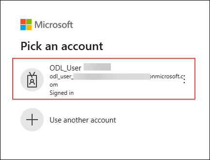
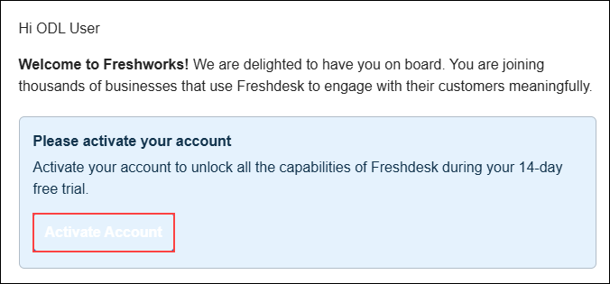
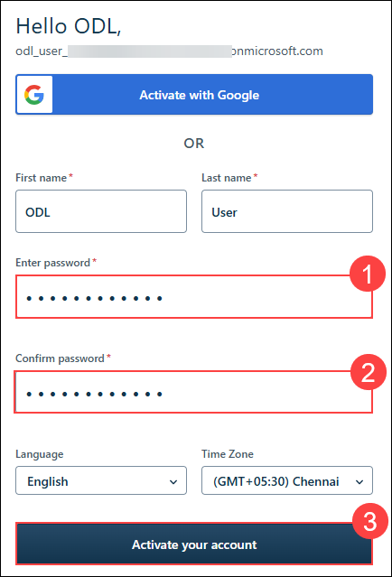
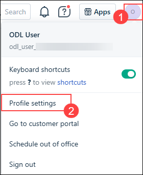
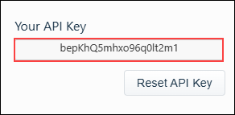
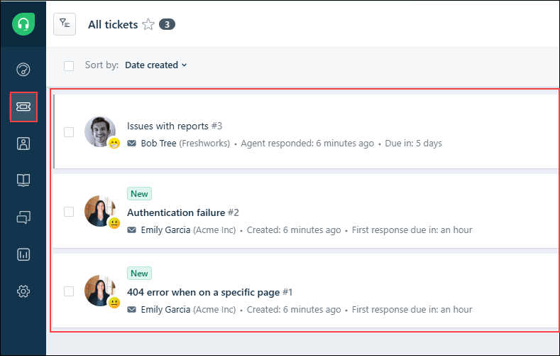

# Exercise 3: Integrating Tools & Data with Model Context Protocol

## Estimated Duration: 90 Minutes

## Overview

In this exercise, you’ll extend your enterprise agent system by connecting it to real organizational data and external services using the Model Context Protocol (MCP). You’ll integrate Azure AI Search to provide context-grounded responses from indexed knowledge bases and connect a Freshdesk API to enable agents to perform real-world actions, such as creating HR or Finance tickets.

By completing this exercise, your agents will evolve from static conversational models to intelligent, data-aware, and action-driven assistants capable of securely interacting with enterprise systems.

## Exercise Objectives

You'll perform the following task in this exercise

- Task 1: Build the Azure Search MCP Tool
- Task 2: Attach Tool to Agents, Enrich Prompts, and Run Tests
- Task 3: Setting up Freshworks for Ticket Management
- Task 4: Connect Agents to an External API (Freshdesk MCP Integration)

### Task 1: Build the Azure Search MCP Tool

In this task you will update environment variables with AI Search credentials, create an async tool class that queries Azure AI Search and returns top-N document snippets which agents will use as context.

MCP is a standard that enables AI agents to securely access external knowledge and tools through structured input/output contracts.
It allows agents to retrieve factual information, invoke APIs, and perform actions in a controlled and auditable manner, forming the backbone of grounded and extensible enterprise AI systems.

1. In the Azure Portal, navigate to your resource group, and from the resource list select **ai-knowledge-<inject key="DeploymentID" enableCopy="false"/>** Search service.

   

1. Select **Keys (1)** from the left menu, under Settings and copy the **Query Key (2)** using the copy option as shown.

   

1. Once copied, paste it safely in a notepad, select **Indexes** from left menu under Search Management and copy the **Index Name (2)**.

   

1. As you have created a multi-agent system before, in the visual studio code pane, select `.env` file, as you have to add AI Search keys for connection.

1. In the `.env` file, add this part below the AI Foundry keys.

   ```
   AZURE_SEARCH_ENDPOINT=https://ai-knowledge-<inject key="DeploymentID" enableCopy="false"/>.search.windows.net/
   AZURE_SEARCH_API_KEY=[Query_Key]
   AZURE_SEARCH_INDEX=[Index_Name]
   ```

   
   
   >**Note:** Please replace the `Query_Key` and `Index_Name` values with the ones you have copied earlier.

1. Once done, click on the **Create Folder** option as shown and when it prompts, provide the folder name as `tools`.

   

1. Once after creating, the folder structure will look similar to this.

   

1. Now, select **tools (1)** folder created before and click on **Create file (2)** option as shown. This will create a file under tools folder. 

   

1. Provide the name for the file as `azure_search_tool.py`. 

1. Once created, add the following code snippet to configure a search tool for your agent.

   ```python
   import os
   import sys
   import aiohttp
   import json
   import asyncio
   from typing import List
   from pathlib import Path

   # Add parent directory to path for imports
   sys.path.append(str(Path(__file__).parent.parent))

   class AzureSearchTool:
      """
      Async MCP-like tool to query Azure Cognitive Search index.
      Reads endpoint/key/index from environment and returns joined content snippets.
      """
      def __init__(self):
         self.endpoint = os.getenv("AZURE_SEARCH_ENDPOINT")
         self.api_key = os.getenv("AZURE_SEARCH_API_KEY")
         self.index_name = os.getenv("AZURE_SEARCH_INDEX")
         if not all([self.endpoint, self.api_key, self.index_name]):
               raise RuntimeError("Azure Search env vars not set (AZURE_SEARCH_ENDPOINT/KEY/INDEX).")
         if not self.endpoint.endswith('/'):
               self.endpoint += '/'
         self.api_version = "2023-11-01"

      async def search(self, query: str, top: int = 5) -> str:
         """
         Query the Azure Search index and return concatenated content snippets.
         """
         url = f"{self.endpoint}indexes/{self.index_name}/docs/search?api-version={self.api_version}"
         headers = {"Content-Type": "application/json", "api-key": self.api_key}
         body = {"search": query, "top": top}

         async with aiohttp.ClientSession() as session:
               async with session.post(url, headers=headers, json=body) as resp:
                  if resp.status != 200:
                     text = await resp.text()
                     raise RuntimeError(f"Azure Search error {resp.status}: {text}")
                  data = await resp.json()
                  docs = data.get("value", [])
                  snippets: List[str] = []
                  for d in docs:
                     snippet = d.get("content") or d.get("text") or d.get("description") or json.dumps(d)
                     snippets.append(snippet.strip())
                  return "\n\n".join(snippets) if snippets else "No results found."

      async def health_check(self):
         """Check if Azure Search service is accessible."""
         try:
               url = f"{self.endpoint}indexes/{self.index_name}?api-version={self.api_version}"
               headers = {"Content-Type": "application/json", "api-key": self.api_key}
               
               async with aiohttp.ClientSession() as session:
                  async with session.get(url, headers=headers) as resp:
                     return {
                           "status": "healthy" if resp.status == 200 else "unhealthy",
                           "status_code": resp.status,
                           "endpoint": self.endpoint,
                           "index": self.index_name
                     }
         except Exception as e:
               return {
                  "status": "error",
                  "error": str(e),
                  "endpoint": self.endpoint,
                  "index": self.index_name
               }

   # Example usage and testing
   async def main():
      """Test the Azure Search tool"""
      try:
         # Load environment variables
         from utils.env import load_env
         load_env()
         
         # Initialize search tool
         search_tool = AzureSearchTool()
         
         # Health check
         health = await search_tool.health_check()
         print(f"Health Status: {json.dumps(health, indent=2)}")
         
         # Test search
         test_queries = [
               "travel reimbursement policy",
               "GDPR compliance requirements", 
               "employee leave policies"
         ]
         
         for query in test_queries:
               print(f"\n{'='*60}")
               print(f"Testing search: {query}")
               print('='*60)
               
               result = await search_tool.search(query, top=3)
               print(result)
               
      except Exception as e:
         print(f"Error testing Azure Search tool: {e}")

   if __name__ == "__main__":
      import asyncio
      asyncio.run(main())
   ```

   

   >Purpose of AzureSearchTool:
   >- This tool provides an async MCP-compatible interface for agents to query the Azure Cognitive Search index and retrieve factual context snippets relevant to user queries.

   >Environment-Based Configuration:
   >- The tool reads Azure Search credentials — endpoint, API key, and index name — directly from environment variables, ensuring secure and flexible configuration.

   >Core Search Functionality (search method):
   >- The search() method sends an async POST request to the Azure Search REST API, fetching top-matching documents and concatenating their content fields into a single contextual string.

   >Testing and Diagnostic Mode:
   >- The file includes a built-in main() routine that loads environment variables, performs a live health check, and runs sample queries for quick standalone validation before agent integration.

1. Once done, please save the file. Click on the **file** option from top menu, select **save** to save the file.

   

1. Select the **... (1)** option from the top menu to extend the menu. Select **Terminal (2)** and click on **New Terminal (3)**.

   

1. Run the below command to test out the working of search tool.

   ```
   python .\tools\azure_search_tool.py
   ```

   

1. You have successfully created an MCP tool that connects your Azure AI Search data to the agent, enabling it to retrieve relevant context from your indexed knowledge base.

### Task 2: Attach Tool to Agents, Enrich Prompts, and Run Tests

In this task you will attach the AzureSearchTool to HR/Finance/Compliance agents, update orchestration to fetch context before calling agents, and run batch & interactive tests.

1. As you have created the tool, now you have to change the orchestration of the agent to trigger the search tool before giving a response.

1. In the Visual Studio Code explorer, open the `main.py` file and replace its existing content with the code provided below.

   ```python
   import asyncio
   import time
   import logging
   import re
   from typing import Dict, Any
   from utils.env import load_env
   from agents.planner_agent import build_planner_agent, classify_target
   from agents.hr_agent import build_hr_agent
   from agents.compliance_agent import build_compliance_agent
   from agents.finance_agent import build_finance_agent
   from tools.azure_search_tool import AzureSearchTool

   # Configure logging
   logging.basicConfig(level=logging.INFO, format='%(asctime)s - %(levelname)s - %(message)s')

   async def run_multi_agent(query: str, agents: Dict[str, Any]) -> Dict[str, Any]:
      """
      Advanced multi-agent system with routing, search context, and ticket creation capabilities.
      """
      start_time = time.time()
      
      try:
         # Step 1: Route the query
         logging.info(f"Routing query: {query[:50]}...")
         target = await classify_target(agents["planner"], query)
         logging.info(f"Query routed to: {target}")
         
         # Step 2: Retrieve relevant context using Azure Search
         logging.info("Retrieving context from knowledge base...")
         context = await agents["search_tool"].search(query, top=3)
         
         # Step 3: Create enriched prompt with context
         enriched_prompt = f"""
   Context from Knowledge Base:
   {context}

   ---

   User Question: {query}

   Please provide a comprehensive answer based PRIMARILY on the context information provided above. 
   Use the knowledge base content as your primary source of truth. If the context contains relevant 
   information, base your answer on that. Only supplement with general knowledge if the context 
   doesn't cover the specific question.

   If no relevant information is found in the context, clearly state that and provide general guidance 
   while recommending the user contact the appropriate department for specific details.
   """
         
         # Step 4: Get response from appropriate agent
         agent_mapping = {
               "HR": ("hr", "HRAgent"),
               "FINANCE": ("finance", "FinanceAgent"), 
               "COMPLIANCE": ("compliance", "ComplianceAgent")
         }
         
         if target in agent_mapping:
               agent_key, agent_name = agent_mapping[target]
               answer = await agents[agent_key].run(enriched_prompt)
         else:
               # Fallback to HR if routing unclear
               logging.warning(f"Unknown target '{target}', falling back to HR")
               answer = await agents["hr"].run(enriched_prompt)
               target = "HR"
               agent_name = "HRAgent"
         
         answer_text = str(answer)
         
         # Step 6: Process response
         response_time = time.time() - start_time
         
         return {
               "query": query,
               "routed_to": target,
               "agent_name": agent_name,
               "answer": answer_text,
               "context_retrieved": len(context) > 100,  # Simple check if context was found
               "ticket_created": False,  # Tickets only created in interactive mode
               "ticket_info": None,
               "response_time": round(response_time, 2),
               "timestamp": time.strftime("%Y-%m-%d %H:%M:%S"),
               "success": True
         }
         
      except Exception as e:
         logging.error(f"Error processing query: {e}")
         return {
               "query": query,
               "routed_to": "ERROR",
               "agent_name": "ErrorHandler",
               "answer": f"I apologize, but I encountered an error processing your request: {str(e)}",
               "context_retrieved": False,
               "ticket_created": False,
               "ticket_info": None,
               "response_time": round(time.time() - start_time, 2),
               "timestamp": time.strftime("%Y-%m-%d %H:%M:%S"),
               "success": False
         }

   def format_response(result: Dict[str, Any]) -> str:
      """Format the agent response for display."""
      status_icon = "✅" if result["success"] else "❌"
      context_icon = "📚" if result.get("context_retrieved") else "📭"
      ticket_icon = "🎫" if result.get("ticket_created") else ""
      
      formatted = f"""
   {status_icon} Agent Response Summary:
   ┌─ Routed to: {result['routed_to']} ({result['agent_name']})
   ├─ Response time: {result['response_time']}s
   ├─ Context retrieved: {context_icon} {'Yes' if result.get('context_retrieved') else 'No'}
   ├─ Ticket created: {ticket_icon} {'Yes' if result.get('ticket_created') else 'No'}
   ├─ Timestamp: {result['timestamp']}
   └─ Status: {'Success' if result['success'] else 'Error'}

   💬 Answer:
   {result['answer']}
   """
      
      # Add ticket details if available
      if result.get("ticket_info") and result["ticket_info"].get("success"):
         ticket = result["ticket_info"]["ticket"]
         formatted += f"""

   🎫 Ticket Details:
   ├─ ID: #{ticket['id']}
   ├─ Status: {ticket['status']}
   ├─ Priority: {ticket['priority']}
   └─ URL: {ticket['url']}
   """
      
      return formatted

   async def run_interactive_mode(agents: Dict[str, Any]):
      """Interactive mode for real-time queries."""
      print("\n🤖 Enterprise Agent System - Interactive Mode")
      print("Available agents: HR, Finance, Compliance")
      print("Type 'quit' to exit, 'help' for commands\n")
      
      while True:
         try:
               query = input("Enter your question: ").strip()
               
               if query.lower() in ['quit', 'exit', 'q']:
                  print("👋 Goodbye!")
                  break
               elif query.lower() == 'help':
                  print("""
   📋 Available Commands:
   - Ask any question about HR, Finance, or Compliance
   - 'quit' or 'exit' - Exit the system
   - 'help' - Show this help message

   🎯 Example questions:
   - "What's the travel reimbursement limit for meals?"
   - "How many vacation days do employees get?"  
   - "Do we need GDPR compliance for EU customers?"
   """)
                  continue
               elif not query:
                  continue
                  
               result = await run_multi_agent(query, agents)
               print(format_response(result))
               
         except KeyboardInterrupt:
               print("\n👋 Goodbye!")
               break
         except Exception as e:
               logging.error(f"Interactive mode error: {e}")
               print(f"❌ Error: {e}")

   async def run_batch_tests(agents: Dict[str, Any]):
      """Run focused test queries with grounded data integration."""
      test_queries = [
         "What is the travel reimbursement limit for hotel stays?",
         "How many vacation days are allowed per year?",
         "Do we need GDPR compliance for EU customers?",
         "What's the budget approval process for large purchases?"
      ]
      
      print("🧪 Running focused batch tests with grounded data integration...\n")
      
      for i, query in enumerate(test_queries, 1):
         print(f"{'='*80}")
         print(f"TEST {i}/{len(test_queries)}: {query}")
         print(f"{'='*80}")
         
         result = await run_multi_agent(query, agents)
         print(format_response(result))
         
         # Small delay between queries for better readability
         if i < len(test_queries):
               await asyncio.sleep(1.0)  # Longer delay for tool operations

   async def main():
      """Main application entry point with enhanced features and tool integration."""
      print("🚀 Initializing Enterprise Agent System with Tools...")
      
      try:
         # Load environment and build agents
         load_env()
         logging.info("Building agent network...")
         
         # Build core agents
         agents = {
               "planner": await build_planner_agent(),
               "hr": await build_hr_agent(), 
               "compliance": await build_compliance_agent(),
               "finance": await build_finance_agent()
         }
         
         # Initialize and attach tools
         logging.info("Initializing tools...")
         
         try:
               search_tool = AzureSearchTool()
               agents["search_tool"] = search_tool
               
               # Test search tool
               health = await search_tool.health_check()
               if health["status"] == "healthy":
                  logging.info("✅ Azure Search tool initialized successfully")
               else:
                  logging.warning(f"⚠️ Azure Search tool health check failed: {health}")
                  
         except Exception as e:
               logging.error(f"Failed to initialize Azure Search tool: {e}")
               # Create mock search tool for testing
               class MockSearchTool:
                  async def search(self, query, top=3):
                     return f"📭 Mock search results for: {query}\n(Azure Search tool not configured)"
               agents["search_tool"] = MockSearchTool()
         
         # Freshdesk integration removed - focusing on grounded search responses only
         
         logging.info("✅ All agents and tools initialized")
         
         # Check if running interactively or in batch mode
         import sys
         if len(sys.argv) > 1 and sys.argv[1] == "--interactive":
               await run_interactive_mode(agents)
         else:
               await run_batch_tests(agents)
               
      except Exception as e:
         logging.error(f"System initialization failed: {e}")
         print(f"❌ Failed to start system: {e}")
         
         # Try to run with minimal configuration
         logging.info("Attempting to run with minimal configuration...")
         try:
               minimal_agents = {
                  "planner": await build_planner_agent(),
                  "hr": await build_hr_agent(),
                  "compliance": await build_compliance_agent(), 
                  "finance": await build_finance_agent(),
                  "search_tool": type('MockSearch', (), {'search': lambda self, q, top=3: f"Mock search for: {q}"})()
               }
               await run_batch_tests(minimal_agents)
         except Exception as minimal_error:
               print(f"❌ Even minimal configuration failed: {minimal_error}")

   if __name__ == "__main__":
      asyncio.run(main())
    ```

   

   >Purpose of Updated Main Script:
   >- This version extends the earlier orchestrator to integrate Azure AI Search via MCP, enabling each agent’s responses to be context-grounded using enterprise data instead of generic LLM reasoning.

   >Search Tool Integration (New Feature):
   >- The AzureSearchTool instance is initialized and attached to the agents dictionary as agents["search_tool"].
   >- Before the system runs, it performs a health check to confirm Azure AI Search connectivity and index readiness.

   >Context Enrichment Logic (Enhanced run_multi_agent):
   >- For every query, the system now fetches related text snippets from Azure Search (context = await agents["search_tool"].search(query)).
   >- The returned context is embedded directly into the prompt before sending to the specialized agent.
   >- The LLM is explicitly instructed to base answers primarily on this contextual data, ensuring factually grounded responses.

1. Once done, please save the file. Click on the **file** option from top menu, select **save** to save the file.

   

1. Select the **... (1)** option from the top menu to extend the menu. Select **Terminal (2)** and click on **New Terminal (3)**.

   

1. Once the terminal is open, run the following command to run the agent and review the responses for the test prompts provided in the code file.

   ```
   python main.py
   ```

   

   > Check **Context retrived** parameter and review how the agent is getting the context from the grounded data.

1. Now, run the agent again on interactive mode by adding `--interactive` flag. This lets you input the question and get the response back. Provide the below prompt as question once it asks.

   ```
   Is employee data protected under GDPR?
   ```
   
1. Once after getting the response, in the next prompt add `q` to quit the agent or stop the agent.

   

### Task 3: Setting up Freshworks for Ticket Management

In this task, you will set up and configure Freshworks to enable tickets management and a enterprise integration for your multi-agent system.

**Freshworks** is a cloud-based customer service and engagement platform designed to improve customer support operations and enhance user satisfaction. It offers a suite of tools for ticket management, live chat, help center creation, and customer self-service. Freshworks supports omnichannel communication, enabling businesses to manage customer interactions across email, chat, phone, and social media from a centralized interface. Its automation features help streamline workflows, assign tickets, and provide analytics for performance tracking. Now you will set up the Freshworks account.

1. Navigate to [Freshworks Portal](https://www.freshworks.com/freshdesk/lp/home/?tactic_id=3387224&utm_source=google-adwords&utm_medium=FD-Search-Brand-India&utm_campaign=FD-Search-Brand-India&utm_term=freshdesk&device=c&matchtype=e&network=g&gclid=EAIaIQobChMIuOK90qvLjQMV_dQWBR3JAi9VEAAYASAAEgK87_D_BwE&audience=kwd-30002131023&ad_id=282519464145&gad_source=1&gad_campaignid=671502402) using a new tab in your browser.

   >Note: Since you are working within a VM, please copy the above link and open it in the browser inside the VM.

1. In the portal, select **Start free trial** to start the free trial.

   

1. In the next pane, provide these details and click on **Try it free (5)**:

   - **First name:** `ODL` **(1)**
   - **Last name:** `User` **(2)**
   - **Work email:** **<inject key="AzureAdUserEmail"></inject>** **(3)**
   - **Company name:** `Contoso` **(4)**

   

1. In the next pane, provide these details and click on **Next (4)**:

   - **What industry are you from ?:** from the list, select **Software and internet (1)**
   - **How many employees are there in your company?:** select **1-10 (2)**
   - select **I'm trying customer service software for the first time (3)**

   

1. Once done, navigate to [Outlook](https://go.microsoft.com/fwlink/p/?LinkID=2125442&clcid=0x409&culture=en-us&country=us).

1. In the pick an account pane, select the account which you are assigned for this lab.

   

1. In the freshworks verification email, open and click on **Activate Account**.

   

   >**Note:** If you're unable to locate the activation email from Freshworks, please wait a few minutes, as there might be a delay in email delivery. If the email doesn't arrive after some time, consider reinitiating the steps to activate your free trial in a new private/incognito window. Additionally, check your spam or junk folder, as the email might have been filtered there.

1. In the next pane, provide **<inject key="AzureAdUserPassword"></inject>** as **Enter password (1)** and provide the same password for **Confirm password (2)**. Click on **Activate your account (3)**.

   

1. Once you are in the portal, click on the **Profile (1)** icon from top right corner and select **Profile settings (2)**.

   

1. In the profile page, click on **View API Key** to get the API Keys.

   

   >**Note:** If you are not able to find this option, please minimize the screensize using **CTRL + -**.

1. In the next pane, complete the **CAPTCHA**.

   

1. Please copy the API Key to a notepad, you will be using this further.

   

1. From the browser tab, please copy the **Account URL** as shown and copy the value to notepad. You will be using this further.

   

1. From the left, click on **Tickets** icon from left menu, you can see some default tickets which are present.

   

1. Once done, navigate to Visual Studio Code pane and open `.env` file.

1. In the `.env` file add the following content and add the key and domain URL that you copied earlier.

   ```
   # Freshdesk Configuration
   FRESHDESK_DOMAIN=[Domain_URL]
   FRESHDESK_API_KEY=[API_Key]
   ```

   

1. Once done, please save the file. Click on the **file** option from top menu, select **save** to save the file.

   

### Task 4: Connect Agents to an External API (Freshdesk MCP Integration)

In this task, you’ll create an additional MCP tool that connects your agents to an external Freshdesk instance via its REST API.
This tool will allow agents, especially Finance and HR to create real tickets when users request actions such as reimbursements, travel approvals, or policy clarification

1. Once environment variables are configured, now, it's time to create the tool which handles the integration with freshdesk.

1. From the explorer menu, select **tools (1)** folder and click on **Create File (2)** option. 

   

1. Provide the file name as `freshdesk_tool.py`.

   

1. Now, select the file and add the following code snipet to configure the tool.

   ```python
   import os
   import aiohttp
   import base64
   import ssl
   from typing import Dict, Any, Optional

   class FreshdeskTool:
      """
      Async Freshdesk tool to create tickets via Freshdesk REST API.
      """
      def __init__(self):
         self.domain = os.getenv("FRESHDESK_DOMAIN")
         self.api_key = os.getenv("FRESHDESK_API_KEY")
         self.default_priority = int(os.getenv("FRESHDESK_DEFAULT_PRIORITY", "1") or 1)
         self.default_group_id = os.getenv("FRESHDESK_DEFAULT_GROUP_ID") or None

         if not self.domain or not self.api_key:
               raise RuntimeError("Freshdesk domain/API key missing in environment.")

         self.base_url = f"https://{self.domain}/api/v2"
         auth_bytes = f"{self.api_key}:X".encode("utf-8")
         auth_header = base64.b64encode(auth_bytes).decode("utf-8")
         self.headers = {
               "Authorization": f"Basic {auth_header}",
               "Content-Type": "application/json"
         }

      async def create_ticket(self, subject: str, description: str, requester: Optional[Dict[str, str]] = None, tags: Optional[list] = None) -> Dict[str, Any]:
         url = f"{self.base_url}/tickets"
         payload: Dict[str, Any] = {
               "subject": subject,
               "description": description,
               "priority": self.default_priority,
               "status": 2  # 2 = Open status in Freshdesk
         }
         if self.default_group_id:
               try:
                  payload["group_id"] = int(self.default_group_id)
               except ValueError:
                  pass
         if tags:
               payload["tags"] = tags
         if requester:
               if requester.get("email"):
                  payload["email"] = requester.get("email")
               if requester.get("name"):
                  payload["name"] = requester.get("name")

         # Create SSL context that allows insecure connections for testing
         ssl_context = ssl.create_default_context()
         ssl_context.check_hostname = False
         ssl_context.verify_mode = ssl.CERT_NONE
         
         connector = aiohttp.TCPConnector(ssl=ssl_context)
         
         async with aiohttp.ClientSession(connector=connector) as session:
               async with session.post(url, headers=self.headers, json=payload) as resp:
                  data = await resp.json()
                  if resp.status not in (200, 201):
                     raise RuntimeError(f"Freshdesk API error {resp.status}: {data}")
                  ticket = {
                     "id": data.get("id"),
                     "status": data.get("status"),
                     "priority": data.get("priority"),
                     "url": f"https://{self.domain}/helpdesk/tickets/{data.get('id')}"
                  }
                  return {"success": True, "ticket": ticket, "raw": data}

      async def health_check(self):
         """Check Freshdesk connectivity by fetching sample endpoint (accounts may not allow GETs; this is best-effort)."""
         try:
               url = f"{self.base_url}/agents"
               # Create SSL context that allows insecure connections for testing
               ssl_context = ssl.create_default_context()
               ssl_context.check_hostname = False
               ssl_context.verify_mode = ssl.CERT_NONE
               
               connector = aiohttp.TCPConnector(ssl=ssl_context)
               
               async with aiohttp.ClientSession(connector=connector) as session:
                  async with session.get(url, headers=self.headers) as resp:
                     return {"status": "healthy" if resp.status in (200, 403) else "unhealthy", "status_code": resp.status}
         except Exception as e:
               return {"status": "error", "error": str(e)}
   ```

   

   >Purpose of FreshdeskTool:
   >- This class provides an asynchronous interface to integrate the Freshdesk REST API into your agent workflow, enabling automated ticket creation directly from agent actions.

   >Authentication and Setup:
   >- It authenticates using your Freshdesk API key via Basic Auth and constructs requests to the /api/v2/tickets endpoint.
   >- The base URL, API key, and default configurations (priority, group ID) are read securely from environment variables.

   >Ticket Creation Logic:
   >- The create_ticket() method builds a structured JSON payload including subject, description, requester info, and optional tags.
   >- It makes an async POST request to Freshdesk, creating a real ticket and returning normalized metadata (ID, status, priority, URL).

1. Once done, please save the file. Click on the **file** option from top menu, select **save** to save the file.

   

1. From the explorer menu, select `main.py`.

1. Replace the existing code with the following snippet

   ```python
   import asyncio
   import time
   import logging
   import re
   from typing import Dict, Any
   from utils.env import load_env
   from agents.planner_agent import build_planner_agent, classify_target
   from agents.hr_agent import build_hr_agent
   from agents.compliance_agent import build_compliance_agent
   from agents.finance_agent import build_finance_agent
   from tools.azure_search_tool import AzureSearchTool
   from tools.freshdesk_tool import FreshdeskTool

   # Configure logging
   logging.basicConfig(level=logging.INFO, format='%(asctime)s - %(levelname)s - %(message)s')

   def parse_create_ticket_block(response_text: str) -> Dict[str, Any]:
      """
      Parse CREATE_TICKET block from agent response.
      """
      if "CREATE_TICKET" not in response_text:
         return None
      
      # Extract the CREATE_TICKET block
      lines = response_text.split('\n')
      ticket_start = -1
      
      for i, line in enumerate(lines):
         if line.strip() == "CREATE_TICKET":
               ticket_start = i
               break
      
      if ticket_start == -1:
         return None
      
      # Parse ticket details
      ticket_data = {
         "subject": "",
         "body": "",
         "tags": [],
         "email": "system@enterprise.com",
         "name": "Enterprise System User"
      }
      
      # Process lines after CREATE_TICKET
      for line in lines[ticket_start + 1:]:
         line = line.strip()
         if not line:
               continue
               
         if line.startswith("Subject:"):
               ticket_data["subject"] = line[8:].strip()
         elif line.startswith("Body:"):
               ticket_data["body"] = line[5:].strip()
         elif line.startswith("Tags:"):
               tags_str = line[5:].strip()
               if tags_str:
                  ticket_data["tags"] = [tag.strip() for tag in tags_str.split(',')]
         elif line.startswith("Email:"):
               ticket_data["email"] = line[6:].strip()
         elif line.startswith("Name:"):
               ticket_data["name"] = line[5:].strip()
      
      return ticket_data

   async def run_multi_agent_with_user_info(query: str, agents: Dict[str, Any], user_name: str = None) -> Dict[str, Any]:
      """
      Enhanced multi-agent system with CREATE_TICKET pattern support and user name handling.
      """
      start_time = time.time()
      
      try:
         # Step 1: Route the query
         logging.info(f"Routing query: {query[:50]}...")
         target = await classify_target(agents["planner"], query)
         logging.info(f"Query routed to: {target}")
         
         # Step 2: Retrieve relevant context using Azure Search
         logging.info("Retrieving context from knowledge base...")
         context = await agents["search_tool"].search(query, top=3)
         
         # Step 3: Create enriched prompt with context
         enriched_prompt = f"""
   Context from Knowledge Base:
   {context}

   ---

   User Question: {query}

   Please provide a comprehensive answer based on the context above. If no relevant context is found, provide your best guidance based on your training.
   """
         
         # Step 4: Get agent response
         agent_key = target.lower()
         agent_name = f"{target}Agent"
         
         if agent_key in agents:
               logging.info(f"Processing with {agent_name}...")
               answer = await agents[agent_key].run(enriched_prompt)
         else:
               # Fallback to HR if routing unclear
               logging.warning(f"Unknown target '{target}', falling back to HR")
               answer = await agents["hr"].run(enriched_prompt)
               target = "HR"
               agent_name = "HRAgent"
         
         answer_text = str(answer)
         
         # Step 5: Check for CREATE_TICKET pattern in response
         ticket_info = None
         ticket_created = False
         
         ticket_data = parse_create_ticket_block(answer_text)
         
         if ticket_data and "freshdesk_tool" in agents:
               logging.info("CREATE_TICKET pattern detected - creating Freshdesk ticket")
               
               # Use provided user name if available
               if user_name:
                  ticket_data["name"] = user_name
                  logging.info(f"Using provided user name: {user_name}")
               
               try:
                  # Create ticket using parsed data
                  ticket_result = await agents["freshdesk_tool"].create_ticket(
                     subject=ticket_data["subject"] or f"{target} Request: {query[:60]}...",
                     description=ticket_data["body"] or f"Request: {query}\n\nAgent Response:\n{answer_text}",
                     tags=ticket_data["tags"] or [target.lower(), "agent-system"],
                     requester={
                           "name": ticket_data["name"],
                           "email": ticket_data["email"]
                     }
                  )
                  
                  if ticket_result.get("success"):
                     ticket_info = ticket_result
                     ticket_created = True
                     ticket_id = ticket_result.get("ticket", {}).get("id")
                     ticket_url = ticket_result.get("ticket", {}).get("url")
                     
                     # Replace CREATE_TICKET block with success message
                     if "CREATE_TICKET" in answer_text:
                           # Remove the CREATE_TICKET block and replace with success message
                           lines = answer_text.split('\n')
                           filtered_lines = []
                           skip_ticket_block = False
                           
                           for line in lines:
                              if line.strip() == "CREATE_TICKET":
                                 skip_ticket_block = True
                                 # Add success message with user name
                                 success_msg = f"""
   🎫 **Support Ticket Created Successfully**
   - Ticket ID: #{ticket_id}
   - Subject: {ticket_data["subject"]}
   - Requester: {ticket_data["name"]}
   - Status: Open
   - URL: {ticket_url}

   Your request has been submitted to our {target} team. You will receive updates via email.
   """
                                 filtered_lines.append(success_msg)
                                 continue
                              elif skip_ticket_block and (line.startswith("Subject:") or line.startswith("Body:") or 
                                                         line.startswith("Tags:") or line.startswith("Email:") or 
                                                         line.startswith("Name:")):
                                 continue
                              else:
                                 skip_ticket_block = False
                                 filtered_lines.append(line)
                           
                           answer_text = '\n'.join(filtered_lines)
                  else:
                     answer_text += f"\n\n⚠️ **Note**: Could not create support ticket: {ticket_result.get('error', 'Unknown error')}"
                     
               except Exception as e:
                  logging.error(f"Failed to create Freshdesk ticket: {e}")
                  answer_text += f"\n\n⚠️ **Note**: Ticket creation failed: {str(e)}"
         
         # Step 6: Process response
         response_time = time.time() - start_time
         
         return {
               "query": query,
               "routed_to": target,
               "agent_name": agent_name,
               "answer": answer_text,
               "context_retrieved": len(context) > 100,  # Simple check if context was found
               "ticket_created": ticket_created,
               "ticket_info": ticket_info,
               "response_time": round(response_time, 2),
               "timestamp": time.strftime("%Y-%m-%d %H:%M:%S"),
               "success": True,
               "user_name": user_name
         }
         
      except Exception as e:
         logging.error(f"Multi-agent processing error: {e}")
         return {
               "query": query,
               "routed_to": "Error",
               "agent_name": "ErrorHandler",
               "answer": f"I encountered an error processing your request: {str(e)}. Please try again.",
               "context_retrieved": False,
               "ticket_created": False,
               "ticket_info": None,
               "response_time": 0,
               "timestamp": time.strftime("%Y-%m-%d %H:%M:%S"),
               "success": False,
               "user_name": user_name
         }

   async def run_multi_agent(query: str, agents: Dict[str, Any]) -> Dict[str, Any]:
      """
      Wrapper for multi-agent system with no user name.
      """
      return await run_multi_agent_with_user_info(query, agents, None)

   def format_response(result: Dict[str, Any]) -> str:
      """Format the agent response for display."""
      status_icon = "✅" if result["success"] else "❌"
      context_icon = "📚" if result.get("context_retrieved") else "📭"
      ticket_icon = "🎫" if result.get("ticket_created") else ""
      
      formatted = f"""
   {status_icon} Agent Response Summary:
   ┌─ Routed to: {result['routed_to']} ({result['agent_name']})
   ├─ Response time: {result['response_time']}s
   ├─ Context retrieved: {context_icon} {'Yes' if result.get('context_retrieved') else 'No'}
   ├─ Ticket created: {ticket_icon} {'Yes' if result.get('ticket_created') else 'No'}
   ├─ Timestamp: {result['timestamp']}
   └─ Status: {'Success' if result['success'] else 'Error'}

   💬 Answer:
   {result['answer']}
   """
      
      # Add ticket details if available
      if result.get("ticket_info") and result["ticket_info"].get("success"):
         ticket = result["ticket_info"]["ticket"]
         formatted += f"""

   🎫 Ticket Details:
   ├─ ID: #{ticket['id']}
   ├─ Status: {ticket['status']}
   ├─ Priority: {ticket['priority']}
   └─ URL: {ticket['url']}
   """
      
      return formatted

   async def interactive_ticket_creation(agents: Dict[str, Any], base_query: str) -> Dict[str, Any]:
      """
      Simple interactive ticket creation.
      """
      print("\n🎫 **Manual Ticket Creation**")
      print("I'll help you create a support ticket manually.\n")
      
      try:
         # Get basic ticket details
         subject = input(f"📝 Ticket Subject: ").strip() or f"Manual Request: {base_query[:60]}..."
         
         print("\n📄 **Ticket Description** (press Enter twice when done):")
         description_lines = [f"Original Request: {base_query}", ""]
         while True:
               line = input("   ").strip()
               if not line:
                  break
               description_lines.append(line)
         
         description = "\n".join(description_lines)
         
         # Create the ticket directly
         print(f"\n🚀 Creating ticket: '{subject}'...")
         
         ticket_result = await agents["freshdesk_tool"].create_ticket(
               subject=subject,
               description=description,
               tags=["manual", "interactive"],
               requester={
                  "name": "Enterprise System User", 
                  "email": "system@enterprise.com"
               }
         )
         
         if ticket_result.get("success"):
               ticket_info = ticket_result.get("ticket", {})
               print(f"""
   ✅ **Ticket Created Successfully!**

   🎫 Ticket Details:
      • ID: #{ticket_info.get('id')}
      • Subject: {subject}
      • Status: Open
      • URL: {ticket_info.get('url')}

   📧 You will receive email updates about your ticket status.
               """)
               return {
                  "success": True,
                  "ticket_created": True,
                  "ticket_info": ticket_result
               }
         else:
               print(f"❌ **Failed to create ticket**: {ticket_result.get('error', 'Unknown error')}")
               return {"success": False, "ticket_created": False}
               
      except KeyboardInterrupt:
         print("\n🚫 Ticket creation cancelled.")
         return {"success": False, "ticket_created": False}
      except Exception as e:
         print(f"❌ **Error during ticket creation**: {str(e)}")
         return {"success": False, "ticket_created": False}

   async def run_interactive_mode(agents: Dict[str, Any]):
      """Interactive mode for real-time queries with enhanced ticket creation."""
      print("\n🤖 Enterprise Agent System - Interactive Mode")
      print("Available agents: HR, Finance, Compliance")
      print("Type 'quit' to exit, 'help' for commands, 'ticket' for interactive ticket creation\n")
      
      while True:
         try:
               query = input("Enter your question: ").strip()
               
               if query.lower() in ['quit', 'exit', 'q']:
                  print("👋 Goodbye!")
                  break
               elif query.lower() == 'help':
                  print("""
   📋 Available Commands:
   - Ask any question about HR, Finance, or Compliance
   - 'ticket' - Interactive ticket creation mode
   - 'quit' or 'exit' - Exit the system
   - 'help' - Show this help message

   🎯 Example questions:
   - "What's the travel reimbursement limit for meals?"
   - "I need to create a ticket for sick leave"
   - "Can you help me submit a reimbursement request?"
   - "How many vacation days do employees get?"
   - "Do we need GDPR compliance for EU customers?"

   🎫 Ticket Creation:
   - Use 'ticket' command for guided ticket creation
   - Or include phrases like "create ticket", "submit request" in your question
   - For LEAVE and REIMBURSEMENT requests, you'll be prompted for your name
   """)
                  continue
               elif query.lower() == 'ticket':
                  if "freshdesk_tool" not in agents:
                     print("❌ Ticket creation is not available (Freshdesk tool not configured)")
                     continue
                  
                  base_query = input("📝 Describe what you need help with: ").strip()
                  if base_query:
                     await interactive_ticket_creation(agents, base_query)
                  continue
               elif not query:
                  continue
                  
               # Check if this is a leave or reimbursement request that needs user name
               query_lower = query.lower()
               is_leave_request = any(word in query_lower for word in ["leave", "vacation", "sick", "time off", "pto", "holiday"])
               is_reimbursement_request = any(word in query_lower for word in ["reimburse", "expense", "travel", "receipt", "reimbursement"])
               wants_ticket = any(keyword in query_lower for keyword in ["create ticket", "submit ticket", "file ticket", "raise ticket", 
                                 "create request", "submit request", "file request", "need help with",
                                 "open ticket", "new ticket", "support ticket", "help ticket"])
               
               user_name = None
               if (is_leave_request or is_reimbursement_request) and wants_ticket:
                  print("\n👤 For leave and reimbursement requests, I need to collect some information:")
                  user_name = input("Please enter your name: ").strip()
                  if not user_name:
                     print("❌ Name is required for this type of request. Please try again.")
                     continue
                  print(f"✅ Thank you, {user_name}! Processing your request...")
                  
               print("\n🤔 Processing your query...")
               result = await run_multi_agent_with_user_info(query, agents, user_name)
               print(format_response(result))
               print()  # Add spacing between queries
               
         except KeyboardInterrupt:
               print("\n👋 Goodbye!")
               break
         except Exception as e:
               logging.error(f"Interactive mode error: {e}")
               print(f"❌ Error: {e}")
               print()

   async def run_batch_tests(agents: Dict[str, Any]):
      """Run focused test with ticket creation."""
      test_queries = [
         "I need to create a ticket for my travel reimbursement request"
      ]
      
      print("🧪 Running focused batch tests with grounded data integration...\n")
      
      for i, query in enumerate(test_queries, 1):
         print(f"{'='*80}")
         print(f"TEST {i}/{len(test_queries)}: {query}")
         print(f"{'='*80}")
         
         result = await run_multi_agent(query, agents)
         print(format_response(result))
         
         # Small delay between queries for better readability
         if i < len(test_queries):
               await asyncio.sleep(1.0)  # Longer delay for tool operations

   async def main():
      """Main application entry point with enhanced features and tool integration."""
      print("🚀 Initializing Enterprise Agent System with Tools...")
      
      try:
         # Load environment and build agents
         load_env()
         logging.info("Building agent network...")
         
         # Build core agents
         agents = {
               "planner": await build_planner_agent(),
               "hr": await build_hr_agent(), 
               "compliance": await build_compliance_agent(),
               "finance": await build_finance_agent()
         }
         
         # Initialize and attach tools
         logging.info("Initializing tools...")
         
         try:
               search_tool = AzureSearchTool()
               agents["search_tool"] = search_tool
               
               # Test search tool
               health = await search_tool.health_check()
               if health["status"] == "healthy":
                  logging.info("✅ Azure Search tool initialized successfully")
               else:
                  logging.warning(f"⚠️ Azure Search tool health check failed: {health}")
                  
         except Exception as e:
               logging.error(f"Failed to initialize Azure Search tool: {e}")
               # Create mock search tool for testing
               class MockSearchTool:
                  async def search(self, query, top=3):
                     return f"📭 Mock search results for: {query}\n(Azure Search tool not configured)"
               agents["search_tool"] = MockSearchTool()
         
         # Initialize Freshdesk tool for ticket creation
         try:
               freshdesk_tool = FreshdeskTool()
               agents["freshdesk_tool"] = freshdesk_tool
               logging.info("✅ Freshdesk tool initialized successfully")
         except Exception as e:
               logging.warning(f"⚠️ Freshdesk tool initialization failed: {e}")
               # System will work without Freshdesk, just won't create tickets
         
         logging.info("✅ All agents and tools initialized")
         
         # Check if running interactively or in batch mode
         import sys
         if len(sys.argv) > 1 and sys.argv[1] == "--interactive":
               await run_interactive_mode(agents)
         else:
               await run_batch_tests(agents)
               
      except Exception as e:
         logging.error(f"System initialization failed: {e}")
         print(f"❌ Failed to start system: {e}")
         
         # Try to run with minimal configuration
         logging.info("Attempting to run with minimal configuration...")
         try:
               minimal_agents = {
                  "planner": await build_planner_agent(),
                  "hr": await build_hr_agent(),
                  "compliance": await build_compliance_agent(), 
                  "finance": await build_finance_agent(),
                  "search_tool": type('MockSearch', (), {'search': lambda self, q, top=3: f"Mock search for: {q}"})()
               }
               await run_batch_tests(minimal_agents)
         except Exception as minimal_error:
               print(f"❌ Even minimal configuration failed: {minimal_error}")

   if __name__ == "__main__":
      asyncio.run(main())
   ```

   

   >run_multi_agent_with_user_info():
   >- This function extends the original multi-agent logic to handle personalized user interactions and automated ticket creation.
   >- It detects a CREATE_TICKET block in the agent’s response, extracts details (subject, body, tags, requester info), and automatically triggers Freshdesk ticket creation.
   >- Once the ticket is created, it dynamically replaces the block with a confirmation message showing ticket ID, subject, and URL.

   >interactive_ticket_creation():
   >- Introduces a guided manual ticket creation flow where the user can enter the ticket subject and description directly through prompts.
   >- It then calls the Freshdesk tool asynchronously to create the ticket and displays the confirmation details interactively in the terminal.

1. Once done, please save the file. Click on the **file** option from top menu, select **save** to save the file.

   

1. Select the **... (1)** option from the top menu to extend the menu. Select **Terminal (2)** and click on **New Terminal (3)**.

   

1. Once the terminal is open, run the following command to run the agent and review the responses and ticket creation.

   ```
   python main.py
   ```

   

1. Navigate to freshdesk portal, select **Tickets** from the left menu and check the new ticket created.

   

   >**Note:** If you are not able to se ethe ticket, wait for few seconds or refresh the page to see it.

1. Now, run the agent again on interactive mode by adding `--interactive` flag. This lets you input the question and get the response back. Provide the below prompt as question once it asks.

   ```
   I need to create a ticket for my travel reimbursement request. I traveled to New York City from October 15-18, 2025 for the annual client conference. The purpose was to present our new product line to key stakeholders and attend strategic planning sessions. My expenses include flights ($650), hotel accommodation ($480 for 3 nights), meals ($320), local transportation ($85), and conference materials ($45). The total reimbursement amount is $1,580. I have all receipts ready for submission.
   ```

1. Navigate back to freshworks and check the new ticket created and review how the agent added the details using the given details.

   
   
   

1. Once after getting the response, in the next prompt add `q` to quit the agent or stop the agent.

   

1. You have successfully built a multi-agent system that retrieves contextual knowledge from Azure AI Search and seamlessly integrates with Freshdesk for enterprise ticket management.

## Summary

In this exercise, you successfully tested the complete multi-agent system where agents retrieved relevant information from Azure AI Search, identified the appropriate department to handle each query, and created Freshdesk tickets when necessary. This demonstrated how the agents can combine contextual reasoning with real-world actions, making them more efficient and practical for enterprise workflows.


  