# Exercise 4: Agent Deployment and Runtime Management in Azure AI Foundry

## Estimated Duration: 15 Minutes

## Overview

In this exercise, you’ll deploy your multi-agent system (developed using the Microsoft Agent Framework SDK) into the Azure AI Foundry Agent Service.
You’ll publish the configured agent into a managed runtime environment.

You have built a Chat Response Agent till now, which means:

- It handles single-turn, stateless interactions, responding immediately to user inputs.

- It runs locally within your application or SDK, without a persistent backend.

- Each request is processed independently, with no memory or long-term context retained.

- It is ideal for quick chat experiences or testing core logic before full deployment.

Now, you will update this to be a Persistent Agent in Azure AI Foundry, which means:

- It runs as a managed, long-lived service within the Foundry environment.

- It can maintain state and context across sessions for continuity and learning.

- It supports integration with external tools and other agents using MCP and A2A protocols.

- It is optimized for enterprise-scale reliability, monitoring, and compliance.

## Exercise Objectives

You'll perform the following task in this exercise

- Task 1: Deploy Agents to Azure AI Foundry Agent Service

### Task 1: Deploy Agents to Azure AI Foundry Agent Service

In this task, you’ll update the existing agent to be persistant agent and publish each agent to AI Foundry Agent Service as standalone models.

1.  Now, you need to update the codefiles to support the persistant agent system, which registers the agent in AI Foundry agent service.

1. In the Visual Studio Code pane, from the left menu, select `.env` file to update the AI Foundry project keys. 

1. Add the following variables to the file.

    ```
    # Azure AI Project Configuration
    AZURE_AI_PROJECT_ENDPOINT=https://agent-<inject key="DeploymentID" enableCopy="false"/>.services.ai.azure.com/api/projects/agentic-ai-project
    AZURE_AI_MODEL_DEPLOYMENT_NAME=gpt-4o-mini
    ```

    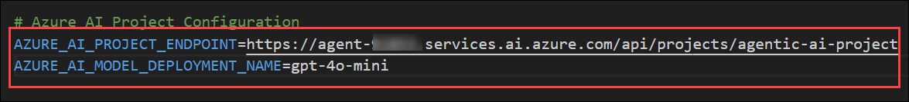

1. Once updated, the file will look similar to this.

    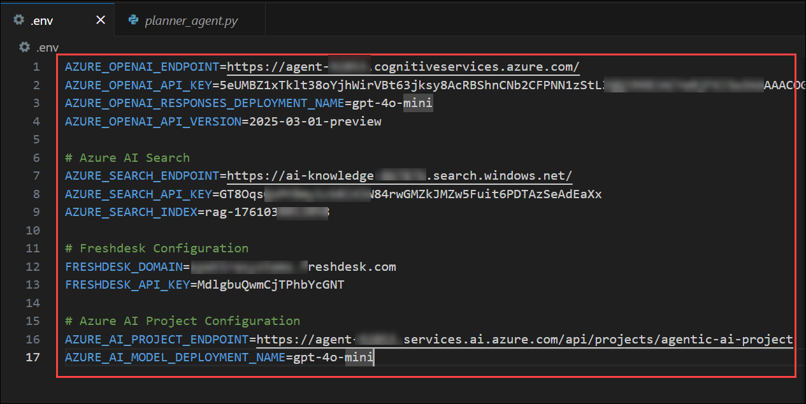

1. Now, you have to update the agents one by one. Select `compliance_agent.py` from explorer menu under **agents**. Replace the content by adding the below code snippet.

    ```python
    import os
    import asyncio
    from azure.ai.projects.aio import AIProjectClient
    from agent_framework import ChatAgent
    from agent_framework.azure import AzureAIAgentClient
    from azure.identity.aio import AzureCliCredential

    async def build_compliance_agent():
        """Build or reuse persistent compliance agent"""
        credential = AzureCliCredential()
        
        async with AIProjectClient(
            endpoint=os.getenv("AZURE_AI_PROJECT_ENDPOINT"), 
            credential=credential
        ) as project_client:
            
            # Try to find existing agent first
            agent_name = "Enterprise-ComplianceAgent"
            try:
                agents = project_client.agents.list_agents()
                async for agent in agents:
                    if agent.name == agent_name:
                        # Return existing persistent agent
                        return ChatAgent(
                            chat_client=AzureAIAgentClient(
                                async_credential=credential,
                                agent_id=agent.id,
                                project_endpoint=os.getenv("AZURE_AI_PROJECT_ENDPOINT"),
                                model_deployment_name=os.getenv("AZURE_AI_MODEL_DEPLOYMENT_NAME")
                            ),
                            instructions="You are a senior compliance and legal specialist."
                        )
            except Exception:
                pass  # Continue to create new agent if listing fails
            
            # Create new persistent agent if not found
            created_agent = await project_client.agents.create_agent(
                model=os.getenv("AZURE_AI_MODEL_DEPLOYMENT_NAME"),
                name=agent_name, 
            instructions=(
                "You are a senior compliance and legal specialist with expertise in multiple jurisdictions. "
                "Provide authoritative guidance on:\n"
                "- GDPR and data protection regulations (EU, UK, US state laws)\n"
                "- Privacy policies and data processing agreements\n"
                "- Regulatory compliance (SOX, HIPAA, PCI-DSS, ISO standards)\n"
                "- Risk assessment and audit requirements\n"
                "- Contract law and vendor agreements\n"
                "- Information security policies\n"
                "- Cross-border data transfers and adequacy decisions\n"
                "- Breach notification requirements\n\n"
                "When provided CONTEXT, prefer it as the primary source. "
                "If the user asks to create a ticket (phrases like \"create a ticket\", \"submit a compliance request\", \"open a support ticket\"), output a structured block starting with:\n"
                "CREATE_TICKET\n"
                "Subject: <one-line subject>\n"
                "Body: <detailed description>\n"
                "Tags: tag1,tag2 (optional)\n"
                "Email: user@example.com (optional)\n"
                "Name: John Doe (optional)\n"
                "Return only the CREATE_TICKET block when requesting a ticket; do not call any APIs yourself.\n\n"
                "Always provide factual, well-researched answers with relevant legal citations. "
                "Include practical implementation steps and potential risks. Use formal, professional tone."
                )
            )
            
            # Return persistent agent wrapped in ChatAgent
            return ChatAgent(
                chat_client=AzureAIAgentClient(
                    async_credential=credential,
                    agent_id=created_agent.id,
                    project_endpoint=os.getenv("AZURE_AI_PROJECT_ENDPOINT"),
                    model_deployment_name=os.getenv("AZURE_AI_MODEL_DEPLOYMENT_NAME")
                ),
                instructions="You are a senior compliance and legal specialist."
            )
    ```

    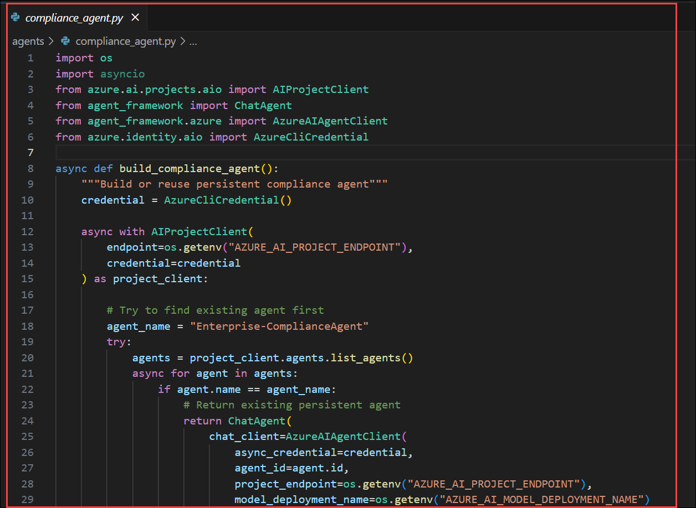

    >Integration with Azure AI Project Client:
    >- The AIProjectClient connects directly to your Azure AI Foundry project endpoint, allowing the script to list, retrieve, or create agents that are hosted persistently within Foundry.

    >Agent Reuse Logic:
    >- Before creating a new agent, the code first checks for an existing agent named "Enterprise-ComplianceAgent".
    >- If found, it reuses that existing agent by linking it via its unique Foundry-managed agent_id.

    >Persistent Agent Creation:
    >- If the agent doesn’t exist, it’s created via project_client.agents.create_agent().
    >- The agent is registered in Foundry with its model, name, and detailed instruction set, making it permanently accessible across sessions.

    >ChatAgent Wrapping:
    >- Once created or retrieved, the persistent Foundry agent is wrapped in a ChatAgent instance using AzureAIAgentClient.
    >- This allows programmatic communication with the hosted agent while maintaining its state, policies, and monitoring features inside Azure AI Foundry.

1. Once done, please save the file. Click on the **file** option from top menu, select **save** to save the file.

    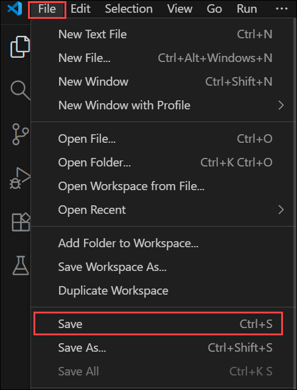

1. Select `finance_agent.py` file, and replace the content with below code snippet to configure persistant finance agent.

    ```python
    import os
    import asyncio
    from azure.ai.projects.aio import AIProjectClient
    from agent_framework import ChatAgent
    from agent_framework.azure import AzureAIAgentClient
    from azure.identity.aio import AzureCliCredential

    async def build_finance_agent():
        """Build or reuse persistent finance agent"""
        credential = AzureCliCredential()
        
        async with AIProjectClient(
            endpoint=os.getenv("AZURE_AI_PROJECT_ENDPOINT"), 
            credential=credential
        ) as project_client:
            
            # Try to find existing agent first
            agent_name = "Enterprise-FinanceAgent"
            try:
                agents = project_client.agents.list_agents()
                async for agent in agents:
                    if agent.name == agent_name:
                        # Return existing persistent agent
                        return ChatAgent(
                            chat_client=AzureAIAgentClient(
                                async_credential=credential,
                                agent_id=agent.id,
                                project_endpoint=os.getenv("AZURE_AI_PROJECT_ENDPOINT"),
                                model_deployment_name=os.getenv("AZURE_AI_MODEL_DEPLOYMENT_NAME")
                            ),
                            instructions="You are a finance and reimbursement specialist."
                        )
            except Exception:
                pass  # Continue to create new agent if listing fails
            
            # Create new persistent agent if not found
            created_agent = await project_client.agents.create_agent(
                model=os.getenv("AZURE_AI_MODEL_DEPLOYMENT_NAME"),
                name=agent_name,
            instructions=(
                "You are a finance and reimbursement specialist. Answer questions about "
                "expense policies, reimbursement limits, budget approvals, travel expenses, "
                "meal allowances, equipment purchases, and financial procedures. Provide "
                "specific amounts, policies, and actionable guidance.\n\n"
                "When provided CONTEXT, prefer it as the primary source. "
                "If the user asks to create a ticket (phrases like \"create a ticket\", \"submit a reimbursement request\", \"open a support ticket\"), output a structured block starting with:\n"
                "CREATE_TICKET\n"
                "Subject: <one-line subject>\n"
                "Body: <detailed description>\n"
                "Tags: tag1,tag2 (optional)\n"
                "Email: user@example.com (optional)\n"
                "Name: John Doe (optional)\n"
                "Return only the CREATE_TICKET block when requesting a ticket; do not call any APIs yourself."
                )
            )
            
            # Return persistent agent wrapped in ChatAgent
            return ChatAgent(
                chat_client=AzureAIAgentClient(
                    async_credential=credential,
                    agent_id=created_agent.id,
                    project_endpoint=os.getenv("AZURE_AI_PROJECT_ENDPOINT"),
                    model_deployment_name=os.getenv("AZURE_AI_MODEL_DEPLOYMENT_NAME")
                ),
                instructions="You are a finance and reimbursement specialist."
            )
    ```

    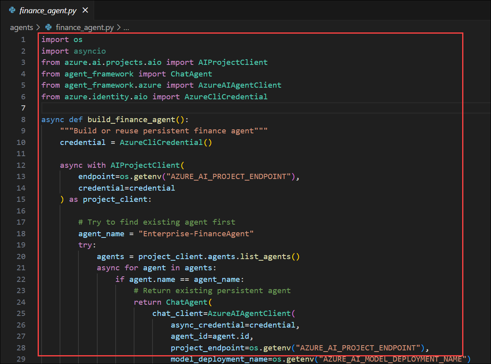

    >Persistent Agent Management via Azure AI Foundry:
    >- The AIProjectClient connects to your Azure AI Foundry project, enabling the script to list, find, or create persistent agents that live within the Foundry environment instead of running locally.

    >Reusability of Existing Agents:
    >- Before creating a new agent, the function checks if an existing "Enterprise-FinanceAgent" already exists.
    >- If found, it reuses that deployed agent by initializing a ChatAgent through its Foundry-managed ID, avoiding duplicate deployments.

    >Automatic Agent Creation (If Missing):
    >- If the agent isn’t found, it creates a new persistent one in Foundry using project_client.agents.create_agent(),
    >- registering it with a model deployment name, unique agent name, and domain-specific instructions focused on finance and reimbursements.

    >Integration with AzureAIAgentClient for Communication:
    >- The created or reused agent is then wrapped in a ChatAgent using AzureAIAgentClient,
    >- which handles authentication, model routing, and persistent communication with the deployed Foundry agent.

1. Once done, please save the file. Click on the **file** option from top menu, select **save** to save the file.

    

1. Now, select `hr_agent.py` file, replace the code with the following, which converts a stateless chat agent to a persistant agent.

    ```python
    import os
    import asyncio
    from azure.ai.projects.aio import AIProjectClient
    from agent_framework import ChatAgent
    from agent_framework.azure import AzureAIAgentClient
    from azure.identity.aio import AzureCliCredential

    async def build_hr_agent():
        """Build or reuse persistent HR agent"""
        credential = AzureCliCredential()
        
        async with AIProjectClient(
            endpoint=os.getenv("AZURE_AI_PROJECT_ENDPOINT"), 
            credential=credential
        ) as project_client:
            
            # Try to find existing agent first
            agent_name = "Enterprise-HRAgent"
            try:
                agents = project_client.agents.list_agents()
                async for agent in agents:
                    if agent.name == agent_name:
                        # Return existing persistent agent
                        return ChatAgent(
                            chat_client=AzureAIAgentClient(
                                async_credential=credential,
                                agent_id=agent.id,
                                project_endpoint=os.getenv("AZURE_AI_PROJECT_ENDPOINT"),
                                model_deployment_name=os.getenv("AZURE_AI_MODEL_DEPLOYMENT_NAME")
                            ),
                            instructions="You are an expert HR policy specialist."
                        )
            except Exception:
                pass  # Continue to create new agent if listing fails
            
            # Create new persistent agent if not found
            created_agent = await project_client.agents.create_agent(
                model=os.getenv("AZURE_AI_MODEL_DEPLOYMENT_NAME"),
                name=agent_name,
            instructions=(
                "You are an expert HR policy specialist with deep knowledge of employment law and best practices. "
                "Answer questions about:\n"
                "- Leave policies (sick, vacation, parental, bereavement)\n"
                "- Employee benefits (health insurance, retirement, wellness programs)\n" 
                "- Performance management and reviews\n"
                "- Hiring, onboarding, and termination procedures\n"
                "- Working hours, overtime, and flexible work arrangements\n"
                "- Employee relations and conflict resolution\n"
                "- Training and development programs\n\n"
                "When provided CONTEXT, prefer it as the primary source. "
                "If the user asks to create a ticket (phrases like \"create a ticket\", \"submit a leave request\", \"open a support ticket\"), output a structured block starting with:\n"
                "CREATE_TICKET\n"
                "Subject: <one-line subject>\n"
                "Body: <detailed description>\n"
                "Tags: tag1,tag2 (optional)\n"
                "Email: user@example.com (optional)\n"
                "Name: John Doe (optional)\n"
                "Return only the CREATE_TICKET block when requesting a ticket; do not call any APIs yourself.\n\n"
                "Provide specific, actionable guidance with policy references where applicable. "
                "Be empathetic and professional in your responses."
                )
            )
            
            # Return persistent agent wrapped in ChatAgent
            return ChatAgent(
                chat_client=AzureAIAgentClient(
                    async_credential=credential,
                    agent_id=created_agent.id,
                    project_endpoint=os.getenv("AZURE_AI_PROJECT_ENDPOINT"),
                    model_deployment_name=os.getenv("AZURE_AI_MODEL_DEPLOYMENT_NAME")
                ),
                instructions="You are an expert HR policy specialist."
            )
    ```

    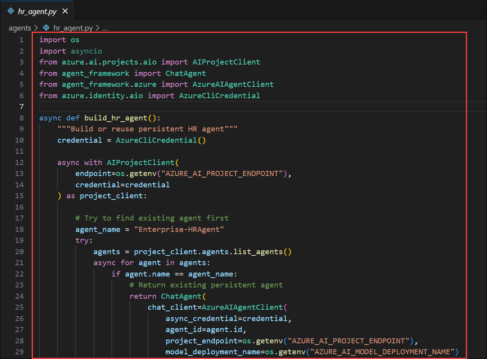

    >This update converts the HR Agent into a persistent, cloud-hosted agent within Azure AI Foundry.
    >It connects to the Foundry project using AIProjectClient, reuses the existing "Enterprise-HRAgent" if deployed, or creates a new one with specialized HR domain instructions.
    >Once deployed, it’s wrapped in a ChatAgent linked via AzureAIAgentClient, enabling stateful, reusable, and centrally managed HR automation within the Foundry environment.

1. Once done, please save the file. Click on the **file** option from top menu, select **save** to save the file.

    

1. Select `planner_agent.py` file, and replace the content with below code snippet to configure persistant orchestrator.

    ```python
    import os
    import asyncio
    from azure.ai.projects.aio import AIProjectClient
    from agent_framework import ChatAgent
    from agent_framework.azure import AzureAIAgentClient
    from azure.identity.aio import AzureCliCredential

    async def build_planner_agent():
        """Build or reuse persistent planner agent"""
        credential = AzureCliCredential()
        
        async with AIProjectClient(
            endpoint=os.getenv("AZURE_AI_PROJECT_ENDPOINT"), 
            credential=credential
        ) as project_client:
            
            # Try to find existing agent first
            agent_name = "Enterprise-PlannerAgent"
            try:
                agents = project_client.agents.list_agents()
                async for agent in agents:
                    if agent.name == agent_name:
                        # Return existing persistent agent
                        return ChatAgent(
                            chat_client=AzureAIAgentClient(
                                async_credential=credential,
                                agent_id=agent.id,
                                project_endpoint=os.getenv("AZURE_AI_PROJECT_ENDPOINT"),
                                model_deployment_name=os.getenv("AZURE_AI_MODEL_DEPLOYMENT_NAME")
                            ),
                            instructions="You are an intelligent routing agent."
                        )
            except Exception:
                pass  # Continue to create new agent if listing fails
            
            # Create new persistent agent if not found
            created_agent = await project_client.agents.create_agent(
                model=os.getenv("AZURE_AI_MODEL_DEPLOYMENT_NAME"),
                name=agent_name,
                instructions=(
                    "You are an intelligent routing agent. Analyze user queries and route them to the appropriate specialist. "
                    "Available specialists:\n"
                    "- HR: Employee policies, leave, benefits, working hours, performance, hiring\n"
                    "- FINANCE: Reimbursements, expenses, budgets, travel costs, meal allowances, equipment purchases\n"
                    "- COMPLIANCE: GDPR, data privacy, regulatory requirements, legal compliance, audits\n\n"
                    "Return exactly one word: HR, FINANCE, or COMPLIANCE. "
                    "Consider keywords like: money, cost, budget, reimburse, expense, payment, allowance → FINANCE\n"
                    "Keywords like: leave, sick, vacation, policy, employee, benefits → HR\n"
                    "Keywords like: GDPR, privacy, compliance, legal, audit, regulation → COMPLIANCE"
                )
            )
            
            # Return persistent agent wrapped in ChatAgent
            return ChatAgent(
                chat_client=AzureAIAgentClient(
                    async_credential=credential,
                    agent_id=created_agent.id,
                    project_endpoint=os.getenv("AZURE_AI_PROJECT_ENDPOINT"),
                    model_deployment_name=os.getenv("AZURE_AI_MODEL_DEPLOYMENT_NAME")
                ),
                instructions="You are an intelligent routing agent."
            )

    async def classify_target(planner_agent, user_query: str) -> str:
        result = await planner_agent.run(
            "Analyze and route this query:\n\n"
            f"User query: {user_query}\n\n"
            "Return exactly one word: HR, FINANCE, or COMPLIANCE."
        )
        # Extract the text content from the AgentRunResponse object
        text = str(result).strip().lower()
        
        # Advanced classification with fallback logic
        if "finance" in text or "financial" in text:
            return "FINANCE"
        elif "hr" in text or "human" in text:
            return "HR"
        elif "compliance" in text or "legal" in text:
            return "COMPLIANCE"
        else:
            # Fallback keyword analysis if agent response is unclear
            query_lower = user_query.lower()
            finance_keywords = ["reimburs", "expense", "cost", "budget", "money", "payment", "allowance", "travel", "meal", "flight", "hotel"]
            hr_keywords = ["leave", "sick", "vacation", "employee", "benefit", "policy", "hire", "performance", "work"]
            compliance_keywords = ["gdpr", "privacy", "compliance", "legal", "audit", "regulation", "data protection"]
            
            finance_score = sum(1 for keyword in finance_keywords if keyword in query_lower)
            hr_score = sum(1 for keyword in hr_keywords if keyword in query_lower)
            compliance_score = sum(1 for keyword in compliance_keywords if keyword in query_lower)
            
            if finance_score > hr_score and finance_score > compliance_score:
                return "FINANCE"
            elif hr_score > compliance_score:
                return "HR"
            else:
                return "COMPLIANCE"
    ```

    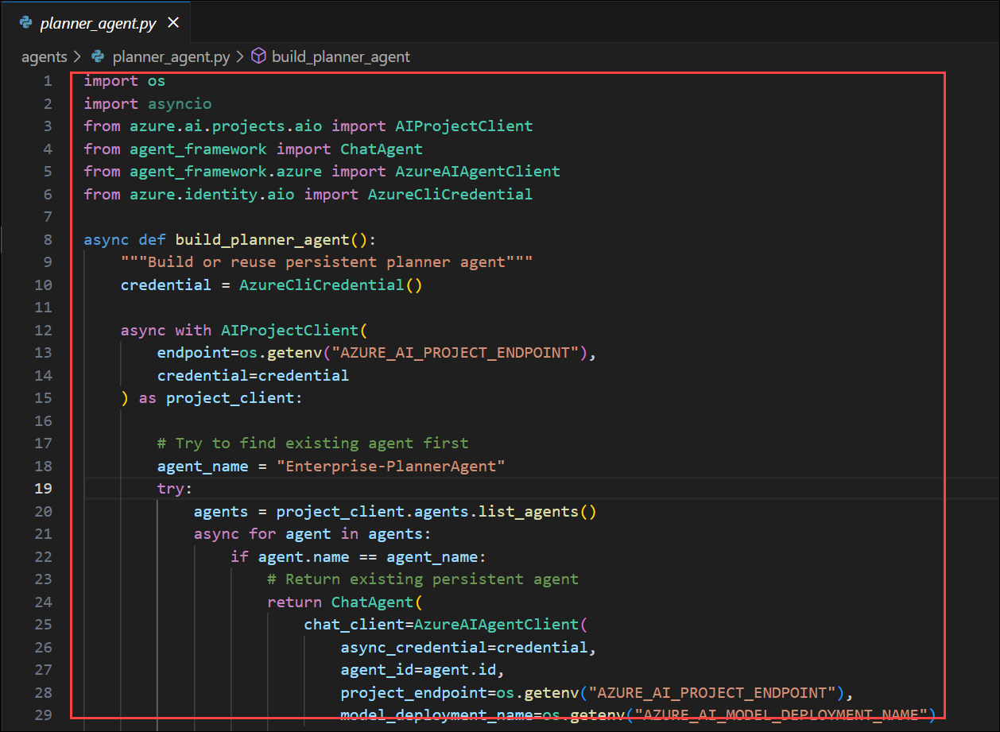

    >It connects through the AIProjectClient, reuses the existing "Enterprise-PlannerAgent" if already deployed, or creates a new one with routing logic that classifies queries into HR, Finance, or Compliance categories.

1. Once done, please save the file. Click on the **file** option from top menu, select **save** to save the file.

    

1. Now, select `main.py` from root and replace the code with the below given snippet. for all the code files please replace the code carefully as python is sensitive for indentations.

    ```python
    import asyncio
    import time
    import logging
    import re
    from typing import Dict, Any
    from utils.env import load_env
    from azure.identity.aio import AzureCliCredential
    from agents.planner_agent import build_planner_agent, classify_target
    from agents.hr_agent import build_hr_agent
    from agents.compliance_agent import build_compliance_agent
    from agents.finance_agent import build_finance_agent
    from tools.azure_search_tool import AzureSearchTool
    from tools.freshdesk_tool import FreshdeskTool

    # Configure logging
    logging.basicConfig(level=logging.INFO, format='%(asctime)s - %(levelname)s - %(message)s')

    def parse_create_ticket_block(response_text: str) -> Dict[str, Any]:
        """
        Parse CREATE_TICKET block from agent response.
        """
        if "CREATE_TICKET" not in response_text:
            return None
        
        # Extract the CREATE_TICKET block
        lines = response_text.split('\n')
        ticket_start = -1
        
        for i, line in enumerate(lines):
            if line.strip() == "CREATE_TICKET":
                ticket_start = i
                break
        
        if ticket_start == -1:
            return None
        
        # Parse ticket details
        ticket_data = {
            "subject": "",
            "body": "",
            "tags": [],
            "email": "system@enterprise.com",
            "name": "Enterprise System User"
        }
        
        # Process lines after CREATE_TICKET
        for line in lines[ticket_start + 1:]:
            line = line.strip()
            if not line:
                continue
                
            if line.startswith("Subject:"):
                ticket_data["subject"] = line[8:].strip()
            elif line.startswith("Body:"):
                ticket_data["body"] = line[5:].strip()
            elif line.startswith("Tags:"):
                tags_str = line[5:].strip()
                if tags_str:
                    ticket_data["tags"] = [tag.strip() for tag in tags_str.split(',')]
            elif line.startswith("Email:"):
                ticket_data["email"] = line[6:].strip()
            elif line.startswith("Name:"):
                ticket_data["name"] = line[5:].strip()
        
        return ticket_data

    async def run_multi_agent_with_user_info(query: str, agents: Dict[str, Any], user_name: str = None) -> Dict[str, Any]:
        """
        Enhanced multi-agent system with CREATE_TICKET pattern support and user name handling.
        """
        start_time = time.time()
        
        try:
            # Step 1: Route the query
            logging.info(f"Routing query: {query[:50]}...")
            target = await classify_target(agents["planner"], query)
            logging.info(f"Query routed to: {target}")
            
            # Step 2: Retrieve relevant context using Azure Search
            logging.info("Retrieving context from knowledge base...")
            context = await agents["search_tool"].search(query, top=3)
            
            # Step 3: Create enriched prompt with context
            enriched_prompt = f"""
    Context from Knowledge Base:
    {context}

    ---

    User Question: {query}

    Please provide a comprehensive answer based on the context above. If no relevant context is found, provide your best guidance based on your training.
    """
            
            # Step 4: Get agent response
            agent_key = target.lower()
            agent_name = f"{target}Agent"
            
            if agent_key in agents:
                logging.info(f"Processing with {agent_name}...")
                answer = await agents[agent_key].run(enriched_prompt)
            else:
                # Fallback to HR if routing unclear
                logging.warning(f"Unknown target '{target}', falling back to HR")
                answer = await agents["hr"].run(enriched_prompt)
                target = "HR"
                agent_name = "HRAgent"
            
            answer_text = str(answer)
            
            # Step 5: Check for CREATE_TICKET pattern in response
            ticket_info = None
            ticket_created = False
            
            ticket_data = parse_create_ticket_block(answer_text)
            
            if ticket_data and "freshdesk_tool" in agents:
                logging.info("CREATE_TICKET pattern detected - creating Freshdesk ticket")
                
                # Use provided user name if available
                if user_name:
                    ticket_data["name"] = user_name
                    logging.info(f"Using provided user name: {user_name}")
                
                try:
                    # Create ticket using parsed data
                    ticket_result = await agents["freshdesk_tool"].create_ticket(
                        subject=ticket_data["subject"] or f"{target} Request: {query[:60]}...",
                        description=ticket_data["body"] or f"Request: {query}\n\nAgent Response:\n{answer_text}",
                        tags=ticket_data["tags"] or [target.lower(), "agent-system"],
                        requester={
                            "name": ticket_data["name"],
                            "email": ticket_data["email"]
                        }
                    )
                    
                    if ticket_result.get("success"):
                        ticket_info = ticket_result
                        ticket_created = True
                        ticket_id = ticket_result.get("ticket", {}).get("id")
                        ticket_url = ticket_result.get("ticket", {}).get("url")
                        
                        # Replace CREATE_TICKET block with success message
                        if "CREATE_TICKET" in answer_text:
                            # Remove the CREATE_TICKET block and replace with success message
                            lines = answer_text.split('\n')
                            filtered_lines = []
                            skip_ticket_block = False
                            
                            for line in lines:
                                if line.strip() == "CREATE_TICKET":
                                    skip_ticket_block = True
                                    # Add success message with user name
                                    success_msg = f"""
    🎫 **Support Ticket Created Successfully**
    - Ticket ID: #{ticket_id}
    - Subject: {ticket_data["subject"]}
    - Requester: {ticket_data["name"]}
    - Status: Open
    - URL: {ticket_url}

    Your request has been submitted to our {target} team. You will receive updates via email.
    """
                                    filtered_lines.append(success_msg)
                                    continue
                                elif skip_ticket_block and (line.startswith("Subject:") or line.startswith("Body:") or 
                                                        line.startswith("Tags:") or line.startswith("Email:") or 
                                                        line.startswith("Name:")):
                                    continue
                                else:
                                    skip_ticket_block = False
                                    filtered_lines.append(line)
                            
                            answer_text = '\n'.join(filtered_lines)
                    else:
                        answer_text += f"\n\n⚠️ **Note**: Could not create support ticket: {ticket_result.get('error', 'Unknown error')}"
                        
                except Exception as e:
                    logging.error(f"Failed to create Freshdesk ticket: {e}")
                    answer_text += f"\n\n⚠️ **Note**: Ticket creation failed: {str(e)}"
            
            # Step 6: Process response
            response_time = time.time() - start_time
            
            return {
                "query": query,
                "routed_to": target,
                "agent_name": agent_name,
                "answer": answer_text,
                "context_retrieved": len(context) > 100,  # Simple check if context was found
                "ticket_created": ticket_created,
                "ticket_info": ticket_info,
                "response_time": round(response_time, 2),
                "timestamp": time.strftime("%Y-%m-%d %H:%M:%S"),
                "success": True,
                "user_name": user_name
            }
            
        except Exception as e:
            logging.error(f"Multi-agent processing error: {e}")
            return {
                "query": query,
                "routed_to": "Error",
                "agent_name": "ErrorHandler",
                "answer": f"I encountered an error processing your request: {str(e)}. Please try again.",
                "context_retrieved": False,
                "ticket_created": False,
                "ticket_info": None,
                "response_time": 0,
                "timestamp": time.strftime("%Y-%m-%d %H:%M:%S"),
                "success": False,
                "user_name": user_name
            }

    async def run_multi_agent(query: str, agents: Dict[str, Any]) -> Dict[str, Any]:
        """
        Wrapper for multi-agent system with no user name.
        """
        return await run_multi_agent_with_user_info(query, agents, None)

    def format_response(result: Dict[str, Any]) -> str:
        """Format the agent response for display."""
        status_icon = "✅" if result["success"] else "❌"
        context_icon = "📚" if result.get("context_retrieved") else "📭"
        ticket_icon = "🎫" if result.get("ticket_created") else ""
        
        formatted = f"""
    {status_icon} Agent Response Summary:
    ┌─ Routed to: {result['routed_to']} ({result['agent_name']})
    ├─ Response time: {result['response_time']}s
    ├─ Context retrieved: {context_icon} {'Yes' if result.get('context_retrieved') else 'No'}
    ├─ Ticket created: {ticket_icon} {'Yes' if result.get('ticket_created') else 'No'}
    ├─ Timestamp: {result['timestamp']}
    └─ Status: {'Success' if result['success'] else 'Error'}

    💬 Answer:
    {result['answer']}
    """
        
        # Add ticket details if available
        if result.get("ticket_info") and result["ticket_info"].get("success"):
            ticket = result["ticket_info"]["ticket"]
            formatted += f"""

    🎫 Ticket Details:
    ├─ ID: #{ticket['id']}
    ├─ Status: {ticket['status']}
    ├─ Priority: {ticket['priority']}
    └─ URL: {ticket['url']}
    """
        
        return formatted

    async def interactive_ticket_creation(agents: Dict[str, Any], base_query: str) -> Dict[str, Any]:
        """
        Simple interactive ticket creation.
        """
        print("\n🎫 **Manual Ticket Creation**")
        print("I'll help you create a support ticket manually.\n")
        
        try:
            # Get basic ticket details
            subject = input(f"📝 Ticket Subject: ").strip() or f"Manual Request: {base_query[:60]}..."
            
            print("\n📄 **Ticket Description** (press Enter twice when done):")
            description_lines = [f"Original Request: {base_query}", ""]
            while True:
                line = input("   ").strip()
                if not line:
                    break
                description_lines.append(line)
            
            description = "\n".join(description_lines)
            
            # Create the ticket directly
            print(f"\n🚀 Creating ticket: '{subject}'...")
            
            ticket_result = await agents["freshdesk_tool"].create_ticket(
                subject=subject,
                description=description,
                tags=["manual", "interactive"],
                requester={
                    "name": "Enterprise System User", 
                    "email": "system@enterprise.com"
                }
            )
            
            if ticket_result.get("success"):
                ticket_info = ticket_result.get("ticket", {})
                print(f"""
    ✅ **Ticket Created Successfully!**

    🎫 Ticket Details:
    • ID: #{ticket_info.get('id')}
    • Subject: {subject}
    • Status: Open
    • URL: {ticket_info.get('url')}

    📧 You will receive email updates about your ticket status.
                """)
                return {
                    "success": True,
                    "ticket_created": True,
                    "ticket_info": ticket_result
                }
            else:
                print(f"❌ **Failed to create ticket**: {ticket_result.get('error', 'Unknown error')}")
                return {"success": False, "ticket_created": False}
                
        except KeyboardInterrupt:
            print("\n🚫 Ticket creation cancelled.")
            return {"success": False, "ticket_created": False}
        except Exception as e:
            print(f"❌ **Error during ticket creation**: {str(e)}")
            return {"success": False, "ticket_created": False}

    async def run_interactive_mode(agents: Dict[str, Any]):
        """Interactive mode for real-time queries with enhanced ticket creation."""
        print("\n🤖 Enterprise Agent System - Interactive Mode")
        print("Available agents: HR, Finance, Compliance")
        print("Type 'quit' to exit, 'help' for commands, 'ticket' for interactive ticket creation\n")
        
        while True:
            try:
                query = input("Enter your question: ").strip()
                
                if query.lower() in ['quit', 'exit', 'q']:
                    print("👋 Goodbye!")
                    break
                elif query.lower() == 'help':
                    print("""
    📋 Available Commands:
    - Ask any question about HR, Finance, or Compliance
    - 'ticket' - Interactive ticket creation mode
    - 'quit' or 'exit' - Exit the system
    - 'help' - Show this help message

    🎯 Example questions:
    - "What's the travel reimbursement limit for meals?"
    - "I need to create a ticket for sick leave"
    - "Can you help me submit a reimbursement request?"
    - "How many vacation days do employees get?"
    - "Do we need GDPR compliance for EU customers?"

    🎫 Ticket Creation:
    - Use 'ticket' command for guided ticket creation
    - Or include phrases like "create ticket", "submit request" in your question
    - For LEAVE and REIMBURSEMENT requests, you'll be prompted for your name
    """)
                    continue
                elif query.lower() == 'ticket':
                    if "freshdesk_tool" not in agents:
                        print("❌ Ticket creation is not available (Freshdesk tool not configured)")
                        continue
                    
                    base_query = input("📝 Describe what you need help with: ").strip()
                    if base_query:
                        await interactive_ticket_creation(agents, base_query)
                    continue
                elif not query:
                    continue
                    
                # Check if this is a leave or reimbursement request that needs user name
                query_lower = query.lower()
                is_leave_request = any(word in query_lower for word in ["leave", "vacation", "sick", "time off", "pto", "holiday"])
                is_reimbursement_request = any(word in query_lower for word in ["reimburse", "expense", "travel", "receipt", "reimbursement"])
                wants_ticket = any(keyword in query_lower for keyword in ["create ticket", "submit ticket", "file ticket", "raise ticket", 
                                "create request", "submit request", "file request", "need help with",
                                "open ticket", "new ticket", "support ticket", "help ticket"])
                
                user_name = None
                if (is_leave_request or is_reimbursement_request) and wants_ticket:
                    print("\n👤 For leave and reimbursement requests, I need to collect some information:")
                    user_name = input("Please enter your name: ").strip()
                    if not user_name:
                        print("❌ Name is required for this type of request. Please try again.")
                        continue
                    print(f"✅ Thank you, {user_name}! Processing your request...")
                    
                print("\n🤔 Processing your query...")
                result = await run_multi_agent_with_user_info(query, agents, user_name)
                print(format_response(result))
                print()  # Add spacing between queries
                
            except KeyboardInterrupt:
                print("\n👋 Goodbye!")
                break
            except Exception as e:
                logging.error(f"Interactive mode error: {e}")
                print(f"❌ Error: {e}")
                print()

    async def run_batch_tests(agents: Dict[str, Any]):
        """Run focused test with ticket creation."""
        test_queries = [
            "What is the company's policy on remote work and flexible hours?",
            "What are the meal allowance limits for domestic business travel?",
            "What are the GDPR requirements for processing customer personal data?"
        ]
        
        print("🧪 Running focused batch tests with grounded data integration...\n")
        
        for i, query in enumerate(test_queries, 1):
            print(f"{'='*80}")
            print(f"TEST {i}/{len(test_queries)}: {query}")
            print(f"{'='*80}")
            
            result = await run_multi_agent(query, agents)
            print(format_response(result))
            
            # Small delay between queries for better readability
            if i < len(test_queries):
                await asyncio.sleep(1.0)  # Longer delay for tool operations

    async def main():
        """Main application entry point with enhanced features and tool integration."""
        print("🚀 Initializing Enterprise Agent System with Persistent Azure AI Foundry Agents...")
        
        try:
            # Load environment and build persistent agents
            load_env()
            logging.info("Building persistent Azure AI Foundry agent network...")
            
            # Build core persistent agents using Azure AI Foundry
            planner_agent_client = await build_planner_agent()
            hr_agent_client = await build_hr_agent()
            compliance_agent_client = await build_compliance_agent()
            finance_agent_client = await build_finance_agent()
            
            async with (
                planner_agent_client as planner_agent,
                hr_agent_client as hr_agent,
                compliance_agent_client as compliance_agent,
                finance_agent_client as finance_agent
            ):
                agents = {
                    "planner": planner_agent,
                    "hr": hr_agent, 
                    "compliance": compliance_agent,
                    "finance": finance_agent
                }
                
                # Initialize and attach tools
                logging.info("Initializing tools...")
                
                try:
                    search_tool = AzureSearchTool()
                    agents["search_tool"] = search_tool
                    
                    # Test search tool
                    health = await search_tool.health_check()
                    if health["status"] == "healthy":
                        logging.info("✅ Azure Search tool initialized successfully")
                    else:
                        logging.warning(f"⚠️ Azure Search tool health check failed: {health}")
                        
                except Exception as e:
                    logging.error(f"Failed to initialize Azure Search tool: {e}")
                    # Create mock search tool for testing
                    class MockSearchTool:
                        async def search(self, query, top=3):
                            return f"📭 Mock search results for: {query}\n(Azure Search tool not configured)"
                    agents["search_tool"] = MockSearchTool()
                
                # Initialize Freshdesk tool for ticket creation
                try:
                    freshdesk_tool = FreshdeskTool()
                    agents["freshdesk_tool"] = freshdesk_tool
                    logging.info("✅ Freshdesk tool initialized successfully")
                except Exception as e:
                    logging.warning(f"⚠️ Freshdesk tool initialization failed: {e}")
                    # System will work without Freshdesk, just won't create tickets
                
                logging.info("✅ All Azure AI Foundry agents and tools initialized")
                
                # Check if running interactively or in batch mode
                import sys
                if len(sys.argv) > 1 and sys.argv[1] == "--interactive":
                    await run_interactive_mode(agents)
                else:
                    await run_batch_tests(agents)
                
        except Exception as e:
            logging.error(f"Azure AI Foundry agent system initialization failed: {e}")
            print(f"❌ Failed to start Azure AI Foundry system: {e}")
            
            # Try to run with minimal configuration
            logging.info("Attempting to run with minimal Azure AI Foundry configuration...")
            try:
                planner_agent_client = await build_planner_agent()
                hr_agent_client = await build_hr_agent()
                compliance_agent_client = await build_compliance_agent()
                finance_agent_client = await build_finance_agent()
                
                async with (
                    planner_agent_client as planner_agent,
                    hr_agent_client as hr_agent,
                    compliance_agent_client as compliance_agent,
                    finance_agent_client as finance_agent
                ):
                    minimal_agents = {
                        "planner": planner_agent,
                        "hr": hr_agent,
                        "compliance": compliance_agent, 
                        "finance": finance_agent,
                        "search_tool": type('MockSearch', (), {'search': lambda self, q, top=3: f"Mock search for: {q}"})()
                    }
                    await run_batch_tests(minimal_agents)
            except Exception as minimal_error:
                print(f"❌ Even minimal Azure AI Foundry configuration failed: {minimal_error}")

    if __name__ == "__main__":
        asyncio.run(main())
    ```

    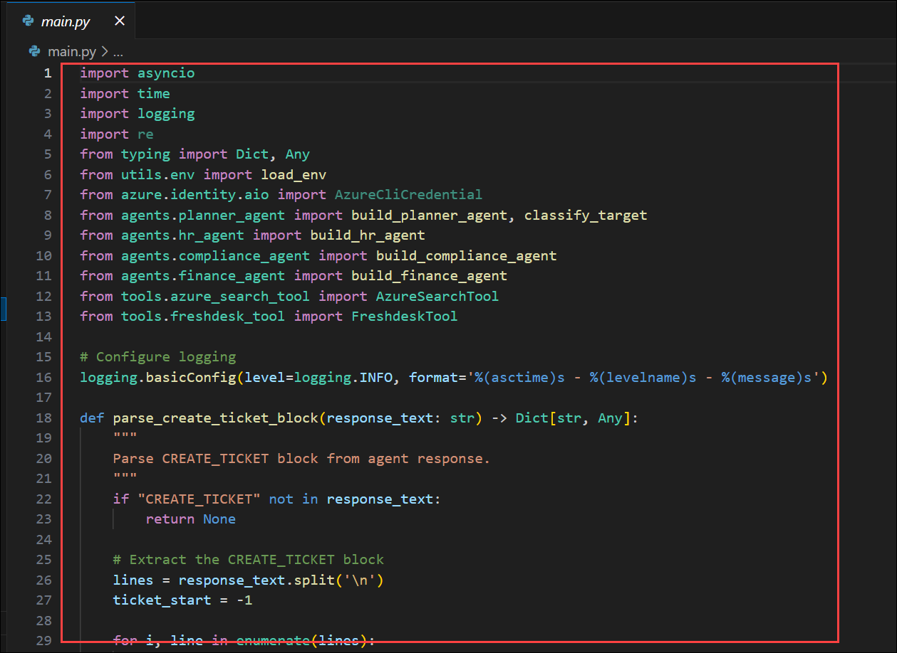

1. Once done, please save the file. Click on the **file** option from top menu, select **save** to save the file.

    

1. The agents are updated successfully with the persistance configurations. Now, run the agent to check the creation o agents in AI Foundry Portal.

1. Select the **... (1)** option from the top menu to extend the menu. Select **Terminal (2)** and click on **New Terminal (3)**.

    

1. In **VS Code** Terminal, run the Azure CLI sign-in command:

   ```powershell
   az login
   ```

    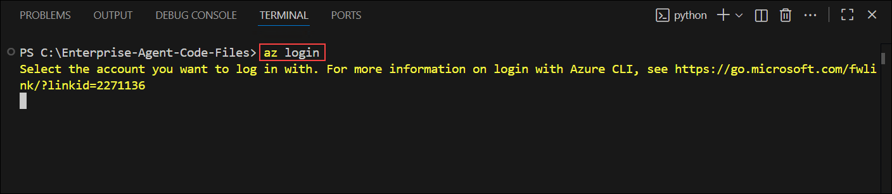

1. On the **Sign in** window, select **Work or school account** and click **Continue**.

    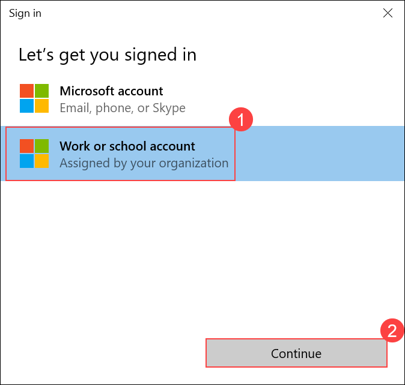

1. On the **Sign into Microsoft** tab, enter the provided email/username and click **Next**.

   - **Email/Username:** <inject key="AzureAdUserEmail"></inject>

        

1. Enter the password and click **Sign in**.

   - **Password:** <inject key="AzureAdUserPassword"></inject>

        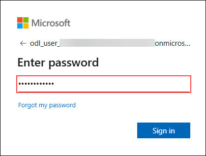

1. When prompted with the sign-in options, select **No, this app only** to continue without linking other desktop apps.

    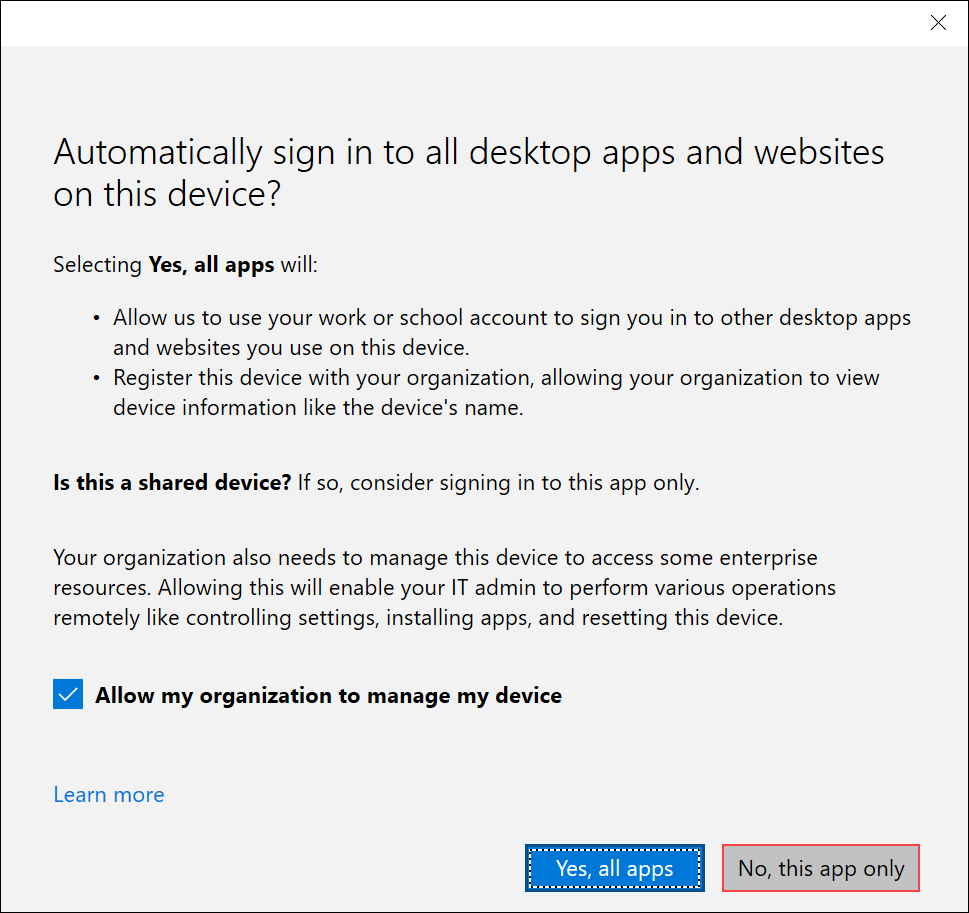

1. When prompted to select a subscription and tenant, type **1** and press **Enter** to continue.
.

    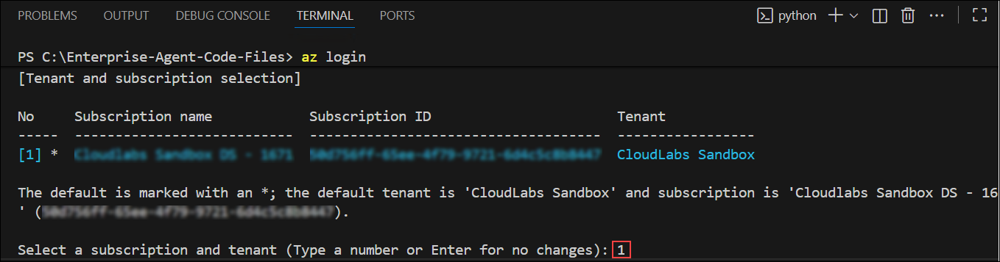

1. Run the below command to test out the working of search tool.

    ```
    python main.py
    ```

    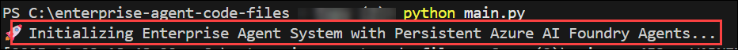

1. Open Azure Portal which is opened previously,navigate to your resource group, from the resource list, select **agent-<inject key="DeploymentID" enableCopy="false"/>** AI foundry resource.

    

1. In the next pane, click on **Go to Azure AI Foundry portal**. you will now be navigated to AI Foundry portal.

    

1. Once navigated to AI Foundry Portal, select **Agents (1)** from the left menu you will see all the agents got resgitered in the AI Foundry portal.

    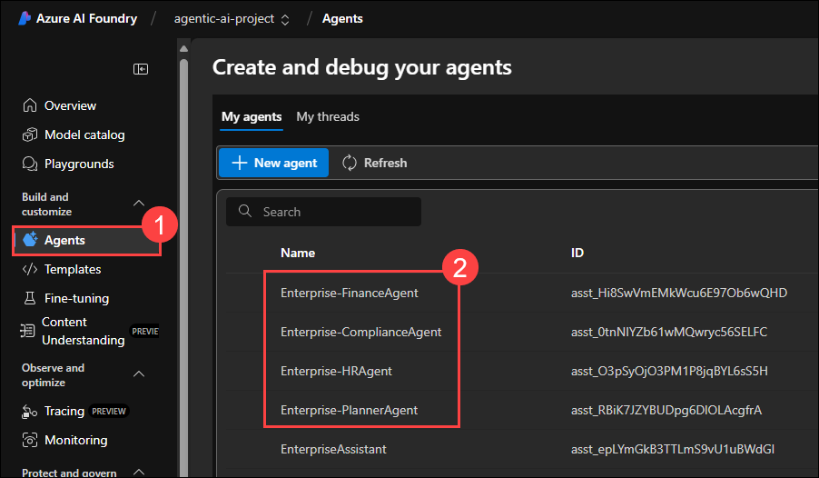

    >As part of using the Microsoft Agent Framework, the agents are designed to operate within either local or cloud-hosted environments, managed programmatically through the SDK rather than the Azure AI Foundry portal UI. Once deployed, these agents persist within the Foundry-managed environment and continue to run as services.

    >From the next exercises onward, you will continue working locally to configure observability, monitoring, and tracing features — enabling you to visualize, analyze, and govern the behavior of these agents as they operate in the cloud.

## Summary

In this exercise, you successfully deployed your locally built multi-agent system into the Azure AI Foundry Agent Service.

