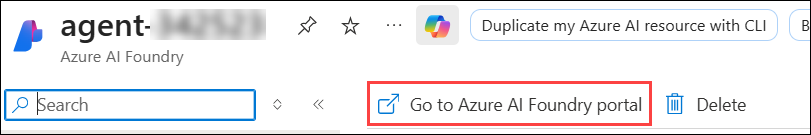

# Exercise 5: AgentOps - Observability, Governance and Lifecycle Management 

## Estimated Duration: 60 Minutes

## Overview

In this exercise, you will focus on AgentOps, the discipline of monitoring, governing, and managing AI agents in production environments.
You’ll explore how to enable observability and telemetry using the Microsoft Agent Framework’s built-in integration with Application Insights using **OpenTelemetry**.

#### About OpenTelemetry in Microsoft Agent Framework

The Microsoft Agent Framework natively integrates with OpenTelemetry, the open standard for distributed tracing, metrics, and logging. It provides end-to-end visibility into agent behavior by automatically capturing telemetry data such as span traces, tool calls, model responses, and workflow performance. Using this integration, developers can export observability data directly to Azure Monitor, Application Insights, or any other OpenTelemetry-compatible backend. This standardized approach helps track every agent action across complex multi-agent systems, enabling performance tuning, troubleshooting, and compliance auditing with minimal configuration.

## Exercise Objectives

You'll perform the following task in this exercise

- Task 1: Enable Observability of Agent with OpenTelemetry
- Task 2: Visualize Agent Metrics
- Task 3: Monitor Agent specific metrics in AI Foundry Portal

### Task 1: Enable Observability of Agent with OpenTelemetry

In this task, you’ll integrate OpenTelemetry and Agent Framework observability into your project. You’ll configure telemetry exporters, initialize tracing with `setup_observability()`, and capture detailed spans for each stage of your workflow, including agent routing, Azure AI Search retrieval, and ticket creation. This enables unified visibility into agent behavior and cross-system correlation using trace IDs in Application Insights.

1. Instead of modifying the previous code again, you’ll work in a new folder that already contains the updated observability-enabled files. Understand how telemetry, tracing, and monitoring are integrated using Microsoft Agent Framework Observability and Application Insights. 

1. In visual studio code, before openening new folder, select `.env` file and copy the content and keep it safely in a notepad.

1. Once done, click on **file** option from top menu and select **Open Folder**.

   

1. In the open folder pane, navigate to `C:\telemetry-codefiles` and click on select folder.

1. Once opened, the files in the explorer menu looks similar to this.

   

1. Please go through the code files, review how the opentelemetry implemented in all agents and how the tracing is happening.

    >Integration Overview

    >Integrated OpenTelemetry tracing throughout the agent workflow using the agent_framework.observability package.
    >- Imported get_tracer() and used OpenTelemetry spans to capture structured telemetry for each critical operation.
    >- Wrapped key functions (e.g., classification, routing, RAG, ticket creation) in spans with contextual attributes.
    >- Added unified startup observability setup using setup_observability() to configure exporters and metrics pipelines.
    >- Recorded custom attributes such as query text, routing decisions, and fallback methods for deeper visibility.
    >- Enhanced error handling to record exception traces and link each workflow execution to a trace ID for cross-system correlation.

    >File Enhancements

    >main.py – End-to-End Tracing and Metrics
    >- Configured OpenTelemetry tracing pipeline and exporter setup.
    >- Wrapped multi-agent orchestration inside spans for complete workflow visibility.
    >- Added spans for sub-steps: routing, data retrieval (RAG), agent responses, and ticket creation.

    >planner_agent.py – Enhanced Routing Observability
    >- Added a tracer instance (get_tracer()) to monitor classification logic.
    >- Captured raw LLM responses, confidence scores, and fallback keyword metrics as span attributes.
    >- Differentiated between AI-based and heuristic classification with labeled spans (SpanKind.INTERNAL).

    >azure_search_tool.py – RAG Observability
    >- Added spans for Azure Search API calls to measure latency and success rates.
    >- Logged retrieved document counts and payload sizes as custom metrics.
    >- Captured search errors and performance data within OpenTelemetry traces.

    >freshdesk_tool.py – Ticket Creation Observability
    >- Added API call spans to track ticket creation duration and response status.
    >- Logged ticket IDs, tags, and requester details for traceable audit logs.
    >- Monitored external API latency and error responses for better incident tracking.

1. Once reviewed, right-Click on **.env.example (1)** file and select **Rename (2)** to rename the file.

   

1. Once done, rename the file from **.env.example** --> **.env** to make this environmnet file active for this agent.

   

1. Now, select the `.env` file and paste the content which you've copied earlier.

1. Once done, add the following app insights variables to the same file.

   ```
   # Observability and Monitoring Configuration
   APPLICATIONINSIGHTS_CONNECTION_STRING=<inject key="AppInsightsConnectionStringWithAppId" enableCopy="false"/>
   ENABLE_OTEL=true
   ENABLE_SENSITIVE_DATA=true
   ```

   

1. Once done, please save the file.

1. Select the **... (1)** option from the top menu to extend the menu. Select **Terminal (2)** and click on **New Terminal (3)**.

    

1. Run the below command to test out the working of search tool.

    ```
    python main.py
    ```

    


### Task 2: Visualize Agent Metrics

In this task, you’ll use Azure Application Insights to visualize agent telemetry data. You’ll explore custom metrics for response time, routing accuracy, and ticket creation success. Then, you’ll build interactive Azure Monitor dashboards to display key performance indicators and trends. This helps identify bottlenecks, measure efficiency, and ensure healthy operation of your deployed agents in real time.

1. Navigate to Azure Portal, open your resource group and from resource list, select **agent-insights-<inject key="DeploymentID" enableCopy="false"/>** app insight resource.

   

1. Once in the overview page, you can see some of the default metrics shown.

   

1. From the left menu, select **Transaction search (1)**, click on **Duration (2)** option as shown and select the Time range as **Last 30 minutes (3)** and click on **Apply (4)**.

   

1. Once done, you will be able to see all the communicaton details happened with agent and all the transaction those aretaken place in the given time range. you can also adjust time range to explore more.

   

1. Explore and review these transations, you can open a detailed view just by clicking on them. Review how you can see all the details like agents, messages and retrival details.

   

   

1. Next, select **Failures (1)**, Review failed requests to gain a centralized view of all unsuccessful executions and identify the underlying causes through detailed trace analysis.

   

1. Next, select **Performance** and check on the operations and response times, based on which you can determine the performance SLA of the agent.

   

1. Now, under monitoring from left menu, select **Metrics**. You can explore the custom metrics whih are published through span.

   

1. Once selected, under **Metric Namespace (1)**, select `azure.applicationinsights` **(2)**.

   

1. Now, under metrics, select `gen_ai.client.operation.duration` and set the aggregation to **avg**. Check the line chart to review the **Response Time** metric, which agent took to reply to user.

   

1. In the similar way, select `gen_ai.client.token.usage` to check the token usage from the agent.

   

1. Next, select **Logs (1)** from left menu, cancel the **Queries hub (2)** pane.

   

1. Once closed, click on **tables** option, hover over the **customMetrics** parameter, you'll see a **Run** option, click on that.

   

   

1. Once the query runs successfully, you will see all the custom metrics listed below as query results.

   

1. Next, select **Workbooks (1)** from left menu and click on **Empty (2)** workbook under Quick start.

   

1. Once opened, click on **+ Add (1)** and select **Add metric (2)**. 

   

1. Once metric pane is opened, click on **Add metric** option. 

   

1. Now, select **Metric** as `gen_ai.client.token.usage` **(1)**, provide **Display name** as `Token Usage` **(2)** and click on **Save (3)**.

   

1. Again click on **Add metric** option.

   

1. Now, select **Metric** as `gen_ai.client.operation.duration` **(1)**, provide **Display name** as `Response Time` **(2)** and click on **Save (3)**.

   

1. Once selected both the metrics, click on **Run Metrics**.

   

1. Now change the **Visualization** to **Area Chart** to get the similar visualization. You can explore with many other options of visualization and also the time range.

   

1. Once the edit is completed, click on **Done editing**. This will save this card to your workbook.

   

1. Now, click on **+ Add (1)** again and select **Add query (2)**.

   

1. In the query pane, add the following **query (1)**, and click on **Run Query (2)**.

   ```
   customMetrics
   ```

   

1. Check the results in the once the query runs successfully. Once reviewed, click on **Done Editing**.

   

1. Once done, click on **Done editing** from the top menu, after that click on **Save** icon. Save the workbook as `agent-workbook`.

1. Since this is a lab environment, the available data may be limited for comprehensive monitoring. However, you can enhance visibility by adding custom metrics from your agents and creating purpose-built monitoring dashboards focused on specific objectives such as the following:

- **Agent Performance Dashboard**

   **Metrics Displayed:**
   - Agent response times (avg, P95)
   - Success rates by agent type
   - Request volume trends
   - Error rate alerts

   **Business Questions Answered:**
   - Which agents perform best?
   - Are we meeting SLA targets?
   - What's causing system slowdowns?

- **User Experience Dashboard**

   **Metrics Displayed:**
   - End-to-end request latency
   - Ticket creation rates
   - Knowledge retrieval success
   - User satisfaction proxy metrics

   **Business Questions Answered:**
   - Are users getting fast responses?
   - How often do requests become support tickets?
   - Is the knowledge base helping users?

### Task 3: Monitor Agent specific metrics in AI Foundry Portal

In this task, you’ll use Azure Application Insights to visualize agent telemetry data. You’ll explore custom agent specific metrics from Azure AI Foundry Portal.

1. As you have already connected application insights to Azure AI Foundry portal, you can navigate back to your AI Foundry portal and visualize the working of your agent.

1. Navigate back to your resource group, from the resource list, select **agent-<inject key="DeploymentID" enableCopy="false"/>** AI foundry resource.

   

1. In the next pane, click on **Go to Azure AI Foundry portal**. you will now be navigated to AI Foundry portal, where you will be creating your first agent.

   

1. Now, navigate to **monitoring** pane, where you have connected application insights before and select **Resource usage** tab and review all the metrics and values.

   

1. Select, Tracing from the left menu, click on any of the trace and review the detailed traces of agent interactions.

   

## Summary

In this exercise, you configured observability and monitoring for your enterprise agents. Using OpenTelemetry tracing, you captured detailed execution data for every workflow step, and by integrating with Azure Application Insights, you created dashboards to visualize performance metrics and agent health.