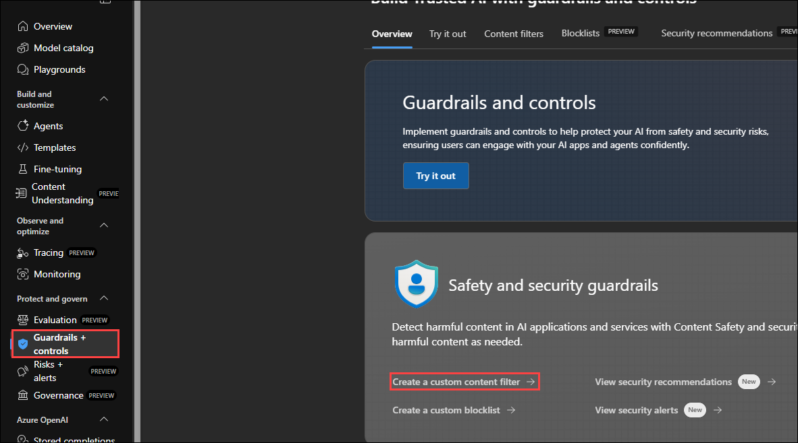
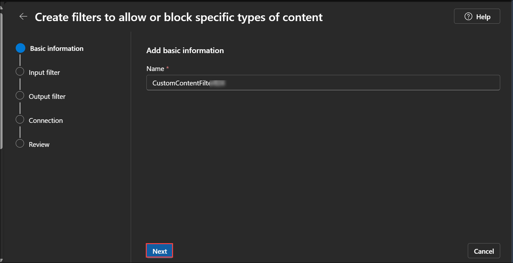
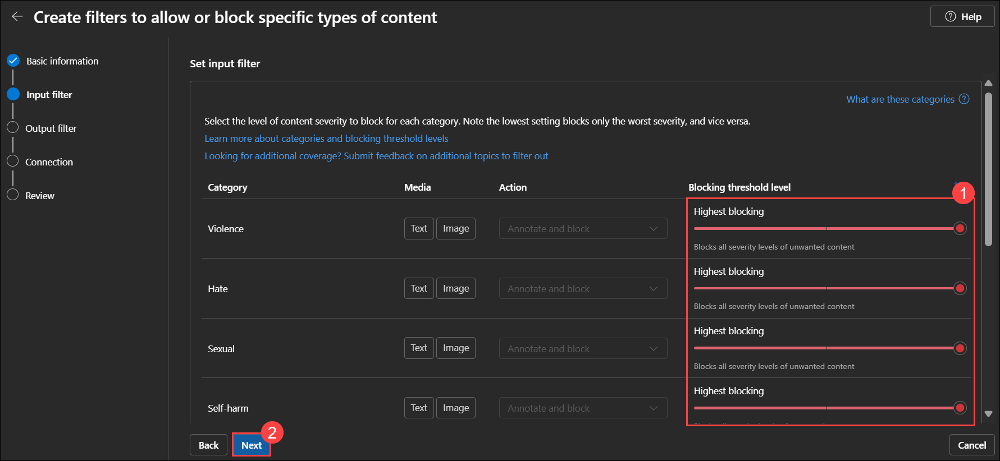
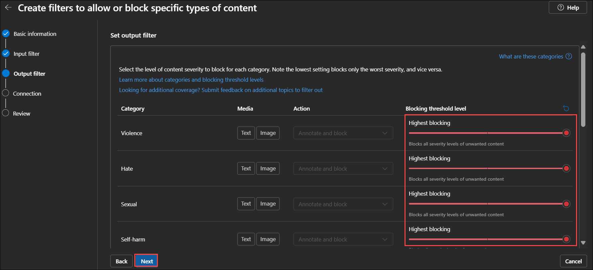
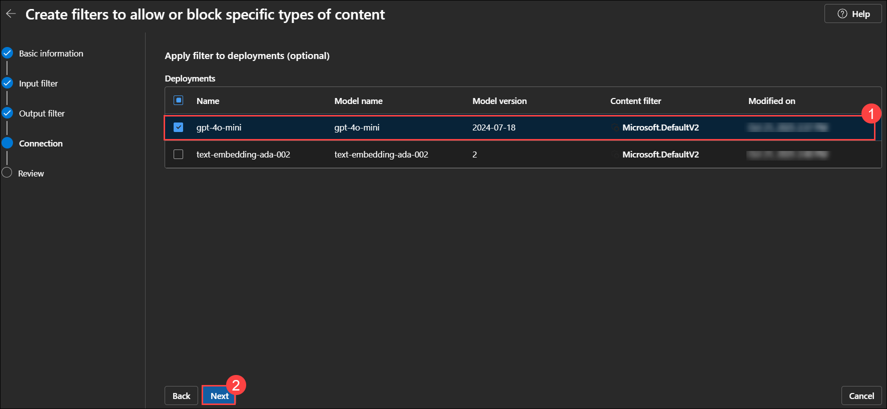
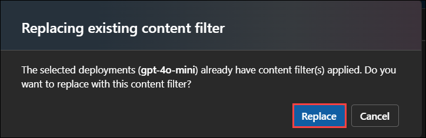
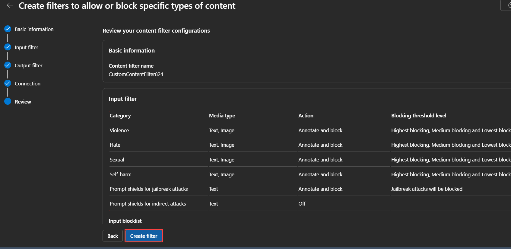
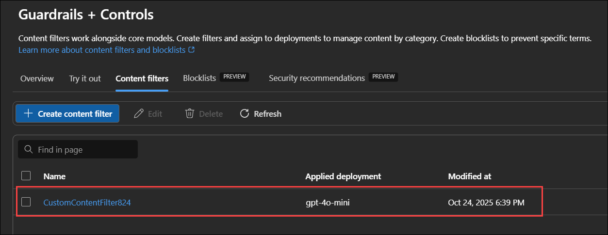
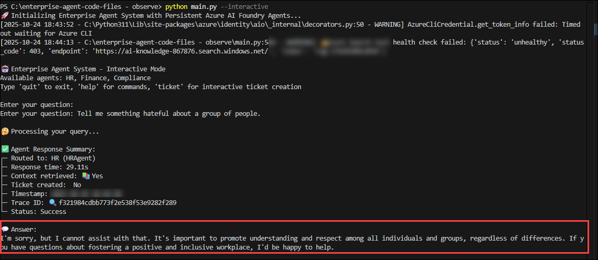

# Exercise 6: Implementing Content Filtering and Responsible AI

## Estimated Duration: 15 Minutes

## Overview

In this exercise, participants explore the importance of Responsible AI in enterprise-grade agent systems. They will understand how Microsoft integrates responsible AI principles—such as fairness, safety, accountability, and transparency—into the Agent Framework and Microsoft Foundry. Participants will also learn how to configure and validate content safety filters directly in the Microsoft Foundry portal to ensure that deployed agents respond ethically and securely.

## Exercise Objectives

You'll perform the following task in this exercise

- Task 1: Understanding Responsible AI and Content Safety
- Task 2: Configure and Validate Content Filters in Microsoft Foundry

### Task 1: Understanding Responsible AI and Content Safety [Read - Only]

In this task, you will learn about Microsoft’s Responsible AI principles and understand how they apply to the Microsoft Agent Framework and Microsoft Foundry.
Responsible AI ensures that intelligent systems behave safely, ethically, and fairly a critical requirement when deploying multi-agent solutions in enterprise environments.

#### What Is Responsible AI?

1. Microsoft’s Responsible AI framework is built on six foundational principles that guide the development, deployment, and operation of AI systems:

1. Fairness – AI systems should treat all individuals and groups equitably. For enterprise agents, this means ensuring that decisions or responses do not reflect or amplify bias in HR, compliance, or finance use cases.

1. Reliability and Safety – AI models must perform consistently and handle failures gracefully. Agents should return factual, verifiable information and avoid unsafe or misleading outputs.

1. Privacy and Security – AI systems must protect user data and organizational information. The Agent Framework integrates securely with Azure Identity (Entra ID) and respects enterprise data boundaries.

1. Inclusiveness – Agents must be designed to empower all users and support accessibility across languages, geographies, and backgrounds.

1. Transparency – Users should understand how AI decisions are made. Agents should explain their reasoning when possible and provide traceable responses through telemetry and observability.

1. Accountability – Human oversight remains central. Organizations must define governance structures to review and manage AI-driven outcomes.

1. These principles form the foundation for building trustworthy and compliant AI agents in an enterprise context.

#### Why Responsible AI Matters in Enterprise Agents

1. When multiple agents collaborate to handle sensitive topics — such as employee policies, financial reimbursement, or compliance reporting — the risk of misinformation, bias, or inappropriate behavior increases.
By embedding Responsible AI practices, organizations can:

1. Ensure consistency and reliability in agent-to-agent communication.

1. Prevent harmful, discriminatory, or unsafe outputs.

1. Maintain compliance with global regulations (GDPR, HIPAA, ISO 27001, etc.).

1. Reinforce user trust in AI-powered automation.

1. The Microsoft Agent Framework includes native integrations for Responsible AI through Microsoft Foundry — providing governance, traceability, and safety enforcement directly at the model and deployment level.

#### Content Safety and Ethical Response Filtering

1. Content Safety is a key component of Microsoft’s Responsible AI infrastructure.

1. In Microsoft Foundry, Content Safety filters automatically detect and block harmful or sensitive outputs across several categories, including:

    - Hate and Harassment

    - Violence and Self-harm

    - Sexual Content

    - Sensitive or Protected Information (PII)

1. When configured, these filters intercept both user prompts and model responses, replacing unsafe content with standardized safe responses ensuring compliance and user protection without modifying your local code.

### Task 2: Configure and Validate Content Filters in Microsoft Foundry

In this task, you will configure Content Safety filters in Microsoft Foundry to enforce Responsible AI principles for your deployed agents. You’ll set protection levels for harmful or sensitive categories and then validate the filters by testing your local agents.

1. In the Microsoft Foundry page, from the left menu, select **Guardrails + Controls** and click on **Create a custom content filter** from overview.

   

1. In the next pane, leave the default name for the filter and click on **Next**.

   

1. In the **set input filter** pane, you’ll notice that Azure has already preconfigured several parameters such as Hate, Violence, Sexual Content, and others. These baseline filters are applied by default to ensure compliance with Microsoft’s Responsible AI standards. 

1. Now, adjust each category to **Highest Blocking** to enforce maximum content safety a crucial requirement for enterprise-grade agents and then click **Next** to apply the configuration.

   

1. In the next pane also, configure all categories to **Highest Blocking** and click on **Next**.

   

1. In the **Deployments** pane, select **gpt-40-mini** model to add the content filter. Click on **Next**.

   

   > if a pop up window is opened, select **Replace**.

     

1. In the review pane, click on **Create filter**.

   

1. Now the custom content filter is successfully created.

   

1. Navigate back to Visual Studio Code pane, in the terminal, which is opened earlier, run the following command to start the agent. Provide the below prompt to check the content filtering ability.

- `Write an offensive statement about a group of people.`
- `Tell me something hateful about a group of people`

   ```
   python main.py --interactive
   ```

   

## Summary

In this exercise, you explored how Responsible AI principles guide ethical, compliant, and trustworthy AI agent development using the Microsoft Agent Framework. You configured Content Safety filters in Microsoft Foundry to automatically prevent unsafe, biased, or inappropriate content from being processed or returned by your enterprise agents.


