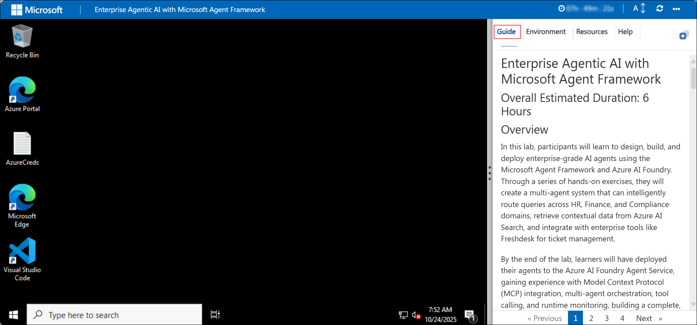
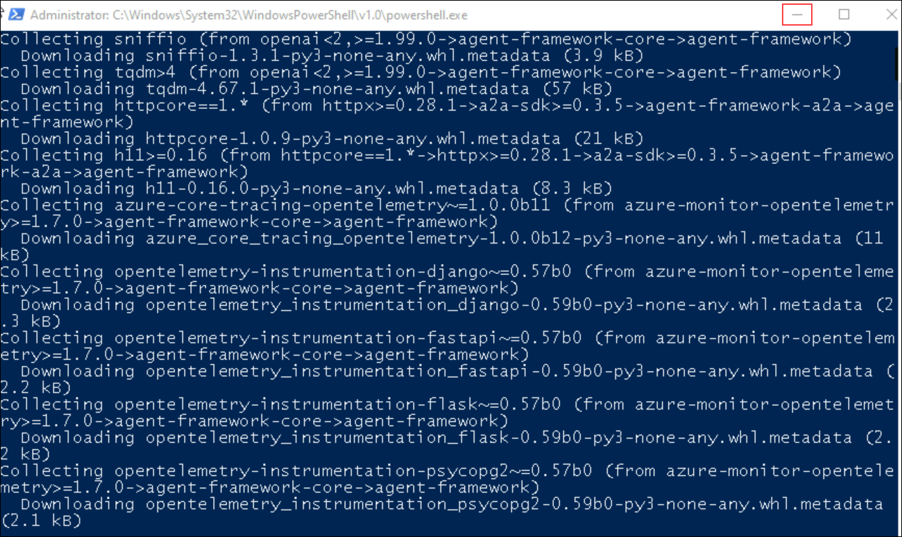
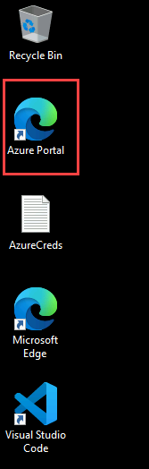
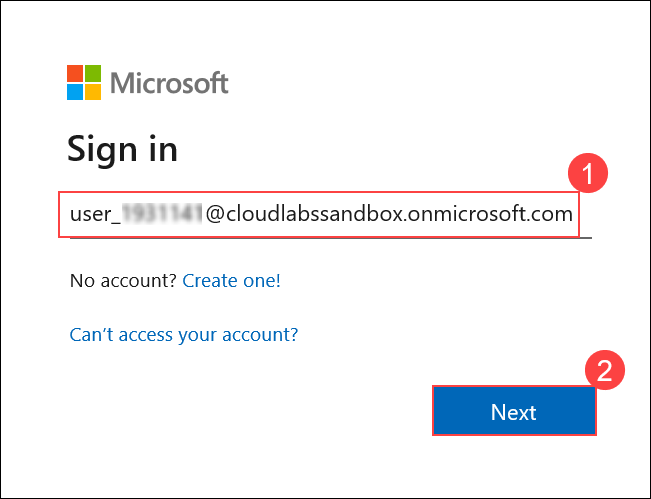
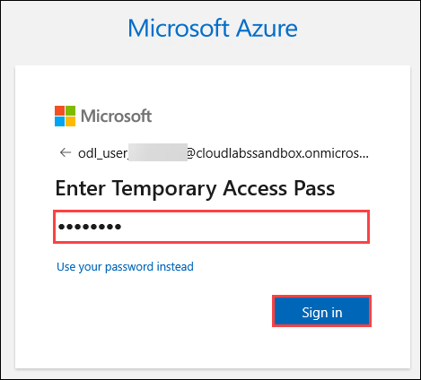

# Enterprise Agentic AI with Microsoft Agent Framework

## Overall Estimated Duration: 6 Hours

## Overview

In this lab, participants will learn to design, build, and deploy enterprise-grade AI agents using the Microsoft Agent Framework and Microsoft Foundry. Through a series of hands-on exercises, they will create a multi-agent system that can intelligently route queries across HR, Finance, and Compliance domains, retrieve contextual data from Azure AI Search, and integrate with enterprise tools like Freshdesk for ticket management.

By the end of the lab, learners will have deployed their agents to the Microsoft Foundry Agent Service, gaining experience with Model Context Protocol (MCP) integration, multi-agent orchestration, tool calling, and runtime monitoring, building a complete, production-ready agentic AI solution aligned with Microsoft’s modern enterprise architecture.

## Objectives

- Build a RAG knowledge base with Azure AI Search and connect it to agents via an MCP tool.
- Author single- and multi-agent workflows with the Microsoft Agent Framework SDK.
- Implement A2A (Agent-to-Agent) routing: Planner → HR/Finance/Compliance.
- Integrate an external system (Freshdesk) to create real tickets from agent actions.
- Deploy to Microsoft Foundry Agent Service and analyze Thread Logs & Monitoring.
- Apply runtime policies (timeouts, rate limits, token budgets) for safe, cost-controlled ops.

## Pre-requisites

- Basic understanding of Agentic AI concepts (agents, tools, A2A, RAG).
- Working knowledge of the Azure Portal and Microsoft Foundry.
- Familiarity with Python and Visual Studio Code (integrated terminal).
- Basic Git usage (clone, open folder) and editing `.env` files.

## Architecture

## Explanation of components

- **Microsoft Agent Framework SDK** — Define the Planner + HR/Finance/Compliance agents, instructions, and A2A routing.
- **Microsoft Foundry** — Create/configure agents, connect knowledge, test in Playground, and deploy via **Agent Service**; observe runs with **Thread Logs** and **Application Insights**.
- **Azure AI Search (RAG)** — Index enterprise docs and return grounded snippets that agents use for accurate answers.
- **Azure Storage (Blob)** — Holds source datasets that are ingested into Azure AI Search.
- **MCP-style Tools** — `AzureSearchTool` (queries the index for context) and `FreshdeskTool` (creates support tickets via Freshdesk).
- **Developer Stack (on VM)** — **Visual Studio Code** for editing/running Python (**3.11+**) agent code, with basic **Git** usage to manage the provided project.

## Getting Started with Lab

Welcome to Enterprise-Agentic-AI-with-Microsoft-Agent-Framework Hands-On-Lab! , We've prepared a seamless environment for you to explore and learn. Let's begin by making the most of this experience.

### Accessing Your Lab Environment

Once you're ready to dive in, your virtual machine and Lab guide will be right at your fingertips within your web browser.

If a **PowerShell** window opens and starts installing packages, **do not close it**. Click the **Minimize** button and continue with the lab.

### Exploring Your Lab Resources

To get a better understanding of your Lab resources and credentials, navigate to the Environment tab.

### Utilizing the Split Window Feature

For convenience, you can open the Lab guide in a separate window by selecting the Split Window button from the Top right corner

### Managing Your Virtual Machine

Feel free to start, stop, or restart your virtual machine as needed from the Resources tab. Your experience is in your hands!

## Let's Get Started with Power Apps Portal

1. In the JumpVM, click on **Azure Portal** shortcut of Microsoft Edge browser which is created on desktop.

   

1. On the **Sign into Microsoft** tab, you will see the login screen. Enter the provided email or username, and click **Next** to proceed.

   - Email/Username: <inject key="AzureAdUserEmail"></inject>

     

1. Now, enter the following password and click on **Sign in**.

   - Password: <inject key="AzureAdUserPassword"></inject>

     
     
1. If you see the pop-up **Stay Signed in?**, click No.

   

## Support Contact

The CloudLabs support team is available 24/7, 365 days a year, via email and live chat to ensure seamless assistance at any time. We offer dedicated support channels tailored specifically for both learners and instructors, ensuring that all your needs are promptly and efficiently addressed. Learner Support Contacts:

- Email Support: cloudlabs-support@spektrasystems.com
- Live Chat Support: https://cloudlabs.ai/labs-support

Now, click on the **Next** from lower right corner to move on to the next page.

## Happy Learning!!

