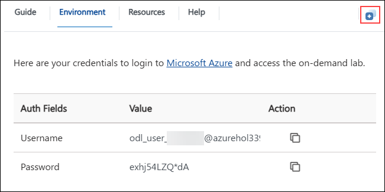
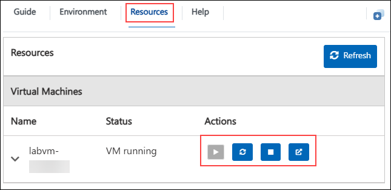
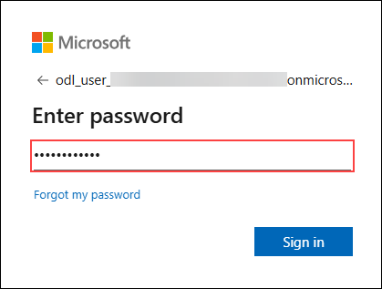
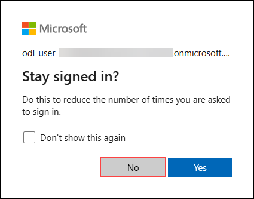
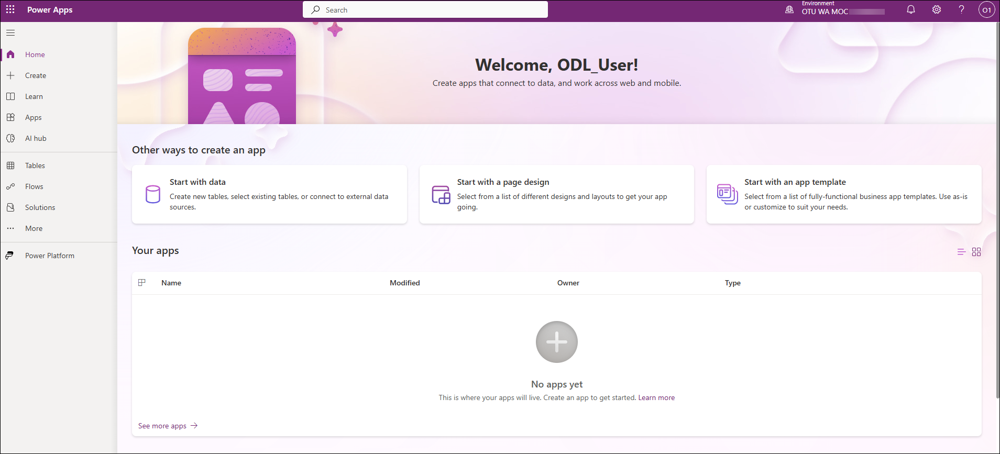

# Enterprise Agentic AI with Microsoft Agent Framework

## Overall Estimated Duration: 6 Hours

## Overview

In this lab, participants will learn to design, build, and deploy enterprise-grade AI agents using the Microsoft Agent Framework and Azure AI Foundry. Through a series of hands-on exercises, they will create a multi-agent system that can intelligently route queries across HR, Finance, and Compliance domains, retrieve contextual data from Azure AI Search, and integrate with enterprise tools like Freshdesk for ticket management.

By the end of the lab, learners will have deployed their agents to the Azure AI Foundry Agent Service, gaining experience with Model Context Protocol (MCP) integration, multi-agent orchestration, tool calling, and runtime monitoring, building a complete, production-ready agentic AI solution aligned with Microsoft’s modern enterprise architecture.

## Objectives

## Pre-requisites

## Architecture

## Explaination of components

## Getting Started with Lab

Welcome to Enterprise-Agentic-AI-with-Microsoft-Agent-Framework Hands-On-Lab! , We've prepared a seamless environment for you to explore and learn. Let's begin by making the most of this experience.

### Accessing Your Lab Environment

Once you're ready to dive in, your virtual machine and Lab guide will be right at your fingertips within your web browser.

### Exploring Your Lab Resources

To get a better understanding of your Lab resources and credentials, navigate to the Environment tab.

### Utilizing the Split Window Feature

For convenience, you can open the Lab guide in a separate window by selecting the Split Window button from the Top right corner

### Managing Your Virtual Machine

Feel free to start, stop, or restart your virtual machine as needed from the Resources tab. Your experience is in your hands!

## Let's Get Started with Power Apps Portal

1. In the JumpVM, click on **Microsoft Edge** shortcut of Microsoft Edge browser which is created on desktop.

   

1. Open a new browser tab and navigate to [Power Apps](https://make.powerapps.com/) portal.

   >Note: Since you are working within a VM, please copy the above link and open it in the browser inside the VM.

1. On the **Sign into Microsoft** tab, you will see the login screen. Enter the provided email or username, and click **Next** to proceed.

   - Email/Username: <inject key="AzureAdUserEmail"></inject>

     

1. Now, enter the following password and click on **Sign in**.

   - Password: <inject key="AzureAdUserPassword"></inject>

     

     >**Note:** If you see the Action Required dialog box, then select Ask Later option.
     
1. If you see the pop-up **Stay Signed in?**, click No.

   

1. You have now successfully logged in to the Power Apps portal. Keep the portal open, as you will be using it later in the lab.

   

## Support Contact

The CloudLabs support team is available 24/7, 365 days a year, via email and live chat to ensure seamless assistance at any time. We offer dedicated support channels tailored specifically for both learners and instructors, ensuring that all your needs are promptly and efficiently addressed.Learner Support Contacts:

- Email Support: cloudlabs-support@spektrasystems.com
- Live Chat Support: https://cloudlabs.ai/labs-support

Now, click on the **Next** from lower right corner to move on next page.

## Happy Learning!!